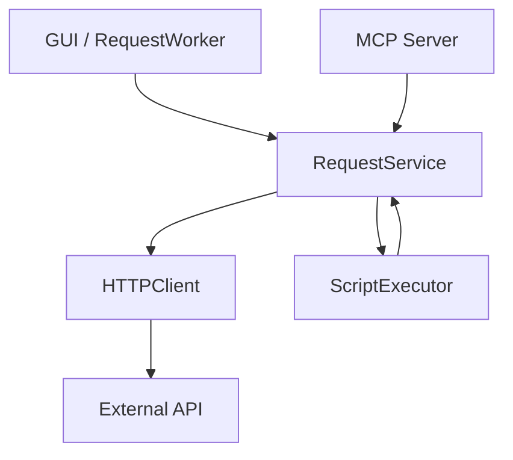

# PYPOST-17: Create abstraction for request execution

## Research

Analysis of the current architecture revealed that request execution logic is duplicated and
inconsistent. `RequestWorker` (GUI) handles requests correctly with script execution, but
`MCPServerImpl` has a simplified and incorrect implementation.

We do not need complex external libraries for this, as the task is solved by refactoring
existing code and extracting a common service layer.

## Implementation Plan

1. **Create `RequestService`**:
   - Implement `RequestService` class in `pypost/core/request_service.py`.
   - Move `HTTPClient` and `ScriptExecutor` invocation logic into `RequestService`.
   - Define return data structure `ExecutionResult`.

2. **Refactor `RequestWorker`**:
   - Replace direct calls to `HTTPClient` and `ScriptExecutor` with `RequestService.execute`.
   - Update result handling for signal transmission.

3. **Refactor `MCPServerImpl`**:
   - Remove manual template rendering code.
   - Remove incorrect `HTTPClient` call.
   - Integrate `RequestService` for request execution.
   - Process `ExecutionResult` to build MCP response (including script logs if needed).

## Architecture

### New Interaction Structure



### Components

#### `RequestService` (`pypost/core/request_service.py`)

Central component for request execution.

* **Responsibility**:
    *   Coordinating the request execution process.
    *   Calling `HTTPClient` for network interaction.
    *   Calling `ScriptExecutor` for post-response handling.
    *   Collecting execution statistics and logs.

* **Interface**:

```python
from dataclasses import dataclass
from typing import Dict, Any, List, Optional
from pypost.models.models import RequestData
from pypost.models.response import ResponseData

@dataclass
class ExecutionResult:
    response: ResponseData
    updated_variables: Dict[str, Any]
    script_logs: List[str]
    script_error: Optional[str]

class RequestService:
    def execute(self, request: RequestData, variables: Dict[str, Any] = None) -> ExecutionResult:
        """
        Executes a request with the given context.
        """
        pass
```

#### `RequestWorker` (`pypost/core/worker.py`)

Adapter for GUI, running `RequestService` in a separate `QThread`.

*   **Changes**:
    *   Remove request execution business logic.
    *   Keep only thread management and result translation to Qt signals.

#### `MCPServerImpl` (`pypost/core/mcp_server_impl.py`)

MCP server implementation.

*   **Changes**:
    *   `call_tool` method delegates execution to `RequestService`.
    *   `ExecutionResult` is converted to MCP response format (`TextContent`).
    *   Script logs may be added to the response for user debugging.

## Q&A

**Q:** Will `RequestService` hold state?
**A:** No, `RequestService` must be stateless. All required data (request, variables) is passed
to the `execute` method.

**Q:** How to handle errors in `RequestService`?
**A:** Exceptions from `HTTPClient` or `ScriptExecutor` should be caught and, if needed, wrapped
in clear errors or returned as part of `ExecutionResult` (for scripts) so the caller can display
them correctly to the user. Critical network errors are raised as exceptions.
