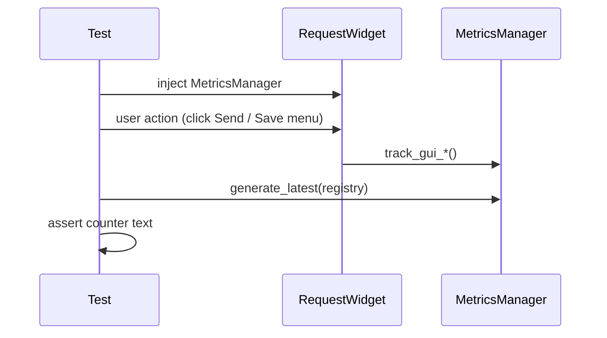

# PYPOST-170: GUI action metrics test architecture

## Research

- `tests/test_metrics_manager.py` — unit-level `track_*` scrape assertions.
- `tests/test_request_editor_method_tab_switch.py` — `TestAutoSwitchMetrics` uses
  `MagicMock` for autoswitch; PYPOST-170 needs registry inspection for Send/Save paths.
- `tests/test_collection_tree_*_metrics.py` — presenter-level mock assertions for tree actions.

Gap: no `RequestWidget` tests that scrape Prometheus after Send click or editor menu/shortcut
actions.

## Implementation Plan

1. Add `tests/test_request_editor_gui_metrics.py` with `MetricsManager` injected into
   `RequestWidget`.
2. Reuse `_scrape` helper pattern from `tests/test_metrics_manager.py`.
3. Drive Send via `QTest.mouseClick` on `send_btn`; drive Save/Save As/Copy cURL via existing
   handler methods (same entry points as menu/shortcut wiring).
4. Document coverage in `doc/dev/testing.md` metrics table and GUI section.

## Test Flow

| Component | Change |
| --- | --- |
| `tests/test_request_editor_gui_metrics.py` | New GUI metrics integration tests |
| `doc/dev/testing.md` | Coverage table + focused run command |
