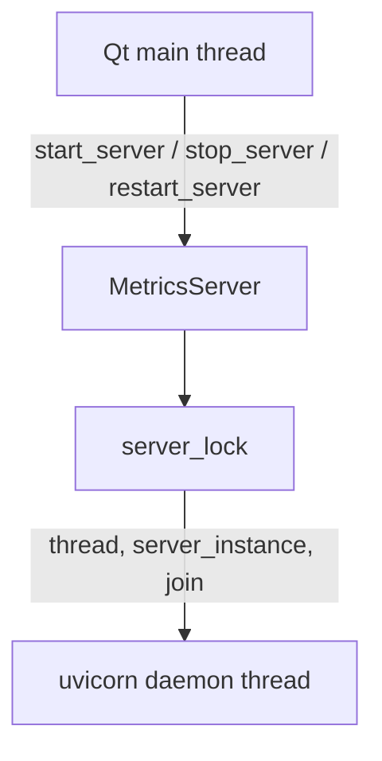

# PYPOST-171: Metrics server lifecycle locking

## Research

| Location | Finding |
| --- | --- |
| `pypost/core/metrics_server.py` | `server_lock = threading.Lock()` guards `start_server` and `stop_server` |
| `pypost/core/metrics.py` | Facade delegates lifecycle to `MetricsServer` — no lock in facade |
| `pypost/main.py` | `start_server` at app boot; `stop_server` at shutdown (main/Qt thread) |
| `pypost/ui/main_window.py` | `restart_server` when metrics host/port settings change (Qt main thread) |
| `track_*` methods | No `server_lock`; counters live in `MetricsRegistry` (Prometheus client) |

## Lock scope

### `start_server(host, port)`

- Acquires `server_lock`.
- If a previous thread is still alive, calls `stop_server()` (see caveat below).
- Sets host/port, clears `_stop_event`, spawns daemon thread running `_run_uvicorn`.
- Releases lock before uvicorn binds (bind runs off lock).

### `stop_server()`

- Acquires `server_lock`.
- Sets `_stop_event`, signals `server_instance.should_exit`, joins thread (2s timeout).
- Clears `thread` and `server_instance`.

### `restart_server(host, port)`

- Calls `stop_server()` then `start_server()` — each acquires/releases lock separately.
- Not one atomic critical section; acceptable because only Qt main thread invokes it today.

## Call-site matrix

| Caller | Method | Thread | Frequency |
| --- | --- | --- | --- |
| `main.py` | `start_server` | Main (pre-`QApplication`) | Once at boot |
| `main.py` | `stop_server` | Main (after event loop) | Once at shutdown |
| `MainWindow._on_settings_saved` | `restart_server` | Qt main | On metrics settings change |

No worker, MCP, or metrics uvicorn thread calls lifecycle methods.

## Review findings

| Item | Severity | Notes |
| --- | --- | --- |
| Lock protects shared `thread` / `server_instance` | OK | Prevents concurrent start/stop from main thread |
| `track_*` without lock | OK | Registry counters; Prometheus client is thread-safe |
| `restart_server` two-phase lock | Low | Gap between stop and start; single caller today |
| `start_server` calls `stop_server` while holding `Lock` | Low | Non-reentrant `Lock` would deadlock if path runs; production never calls `start_server` with live thread (uses `restart_server` instead) |
| `_stop_event` / `_startup_notified` from worker | Low | Signaling flags only; no lock; acceptable for current use |

## Implementation Plan

1. Document lock behavior and caller constraints in `doc/dev/mcp_integration.md`.
2. Record verdict in `60-tech-debt.md` — SAFE TO CLOSE, no refactor.
3. Run `make test`.
