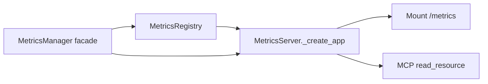

# PYPOST-177: Metrics test architecture

## Research (post PYPOST-75)

| Component | Responsibility | Existing tests | Gap |
| --- | --- | --- | --- |
| `MetricsRegistry` | Prometheus counters, `track_*` | Via `MetricsManager` facade in `test_metrics_manager.py` | No direct MCP counter tests |
| `MetricsServer` | ASGI app, MCP resources, uvicorn | `test_metrics_server_startup.py` (bind/lifecycle) | No `/metrics` HTTP or handler-level MCP counter tests |
| `MetricsManager` | Facade | `test_metrics_manager.py` | `read_resource` success only |

## Test Plan

1. **`tests/test_metrics_registry.py`** — pure unit tests on `MetricsRegistry`:
   - `track_mcp_request_received` / `track_mcp_response_sent` scrape assertions.
2. **`tests/test_metrics_server_endpoint.py`** — ASGI unit tests on `MetricsServer`:
   - `TestClient` GET `/metrics` returns Prometheus text with incremented counters.
   - `read_resource("metrics://all")` increments `mcp_*_total` (server layer).
   - Unknown URI raises `ValueError` without counter side effects.
   - Simulated scrape failure increments `mcp_responses_sent_total{status="error"}`.

## Architecture (unchanged)

No production code changes — tests only.
