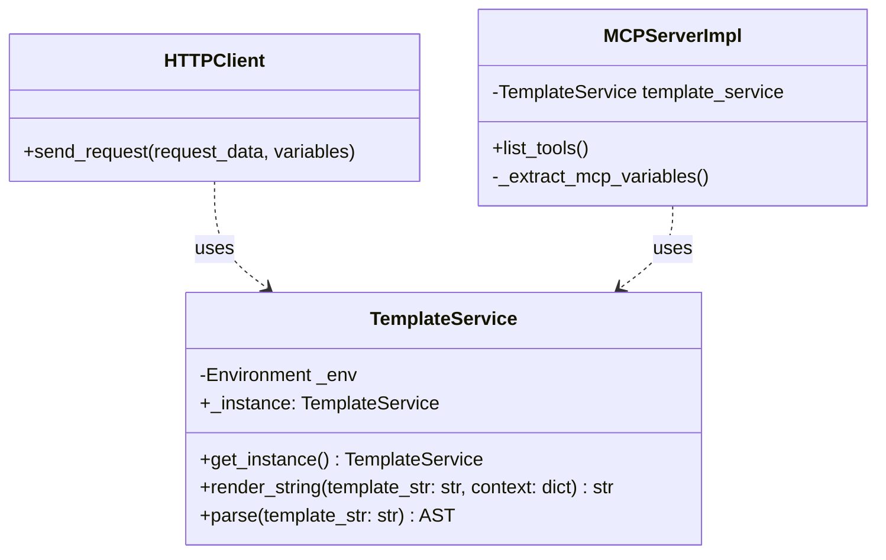

# PYPOST-21: Unify Jinja2 Environment Usage (TemplateService)

## Research

- **Jinja2 Environment:** The `jinja2.Environment` class is thread-safe (usually) if templates are
  not modified dynamically. It is the central place for configuration, filters, tests and global
  variables.
- **Current implementation:**
  - `TemplateEngine.render` (in `pypost/core/template_engine.py`) creates `Template(content)` on
    each call. This is inefficient as it does not reuse Environment.
  - `MCPServerImpl` (in `pypost/core/mcp_server_impl.py`) creates `self.env = Environment()`.
  - `HTTPClient` uses `TemplateEngine.render`.
  - `RequestService` indirectly uses `HTTPClient`.

## Implementation Plan

1.  **Create `TemplateService`**:
    - Create file `pypost/core/template_service.py`.
    - Implement `TemplateService` class as Singleton (or use global module instance) to guarantee
      single `Environment` usage.
    - Initialize `jinja2.Environment` in constructor.
    - Add methods `render_string(template_str: str, context: dict) -> str` and
      `parse(template_str: str) -> AST`.

2.  **Refactor `TemplateEngine`**:
    - Deprecate `TemplateEngine` or redirect its methods to `TemplateService` to minimize caller
      changes initially, but better to replace calls directly.
    - Requirements say "remove or rewrite". Better to rewrite `TemplateEngine` as a facade for
      `TemplateService` for backward compatibility if needed, or fully replace usage. Given
      project size, better to replace usage directly.

3.  **Integrate in `MCPServerImpl`**:
    - Remove `self.env = Environment()`.
    - Use `TemplateService.get_instance().parse(...)` (or injected instance).

4.  **Integrate in `HTTPClient`**:
    - Replace `TemplateEngine.render` calls with `TemplateService.get_instance().render_string`.

## Architecture

### Components



### Implementation Details

- **Singleton Pattern:** For `TemplateService` the Singleton pattern will be used via class method
  `get_instance()` or simply a module with global `_instance` variable initialized on first use. In
  Python modules are singletons anyway, so a simple class instantiated once in the module, or a
  class with `@lru_cache` on the factory, will work. Simplest option:

```python
# pypost/core/template_service.py
from jinja2 import Environment

class TemplateService:
    _instance = None

    def __new__(cls):
        if cls._instance is None:
            cls._instance = super(TemplateService, cls).__new__(cls)
            cls._instance.env = Environment()
        return cls._instance

    def render_string(self, content: str, variables: dict) -> str:
        if not content:
            return ""
        try:
            template = self.env.from_string(content)
            return template.render(**variables)
        except Exception as e:
            print(f"Template rendering error: {e}")
            return content

    def parse(self, content: str):
        return self.env.parse(content)
```

Or even simpler — create an instance in the module:

```python
# pypost/core/template_service.py
from jinja2 import Environment

class TemplateService:
    def __init__(self):
        self.env = Environment()

    def render_string(self, content: str, variables: dict) -> str:
        # ... implementation
        pass
    
    def parse(self, content: str):
        return self.env.parse(content)

# Global instance
template_service = TemplateService()
```

We choose the variant with global `template_service` instance in module
`pypost/core/template_service.py`, as it is the pythonic way.

## Q&A

- **Why Singleton?**
  - To guarantee a single configuration point for Jinja2 Environment (e.g. if we want to add
    global filters or change syntax settings).
- **How will this affect tests?**
  - Tests can mock `template_service` or use the real one. Since `Environment` has no external
    side effects (except CPU/RAM usage), using a real instance in tests is acceptable.
