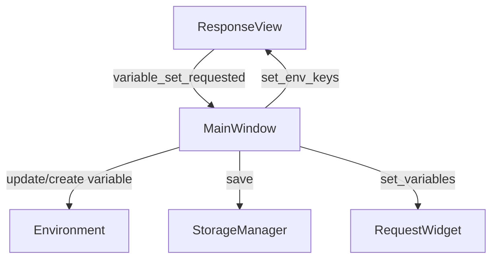

# PYPOST-25: Архитектура

## Обзор

Задача заключается в расширении функциональности `ResponseView` для поддержки контекстного меню с возможностью:
1.  Установки значений переменных окружения (существующих и новых).
2.  Копирования выделенного текста.

Это требует изменений в UI компонентах (`ResponseView`, `MainWindow`) и налаживания взаимодействия между ними через сигналы.

## Диаграмма компонентов

## Изменения в компонентах

### 1. `pypost/ui/widgets/response_view.py`

Класс `ResponseView` отвечает за отображение ответа и контекстное меню.

**Изменения:**

-   **Сигналы**: Обновить сигнал `variable_set_requested(str, str)`. Первый аргумент — имя переменной (`None` для новой), второй — значение.
-   **Метод `show_context_menu`**:
    -   Переработать логику построения меню.
    -   Сначала добавлять меню "Set env".
    -   Внутри "Set env" добавить список текущих ключей и пункт "New Variable...".
    -   Затем добавлять стандартное действие "Copy" (или создавать своё, если стандартное не подходит по порядку, но `QTextEdit` предоставляет стандартное меню, которое можно модифицировать или создать с нуля).
    -   *Решение*: Создать меню с нуля, добавив `Set env`, а затем стандартные действия (Copy).
    -   При выборе "New Variable..." эмитить сигнал с `key=None`.

### 2. `pypost/ui/main_window.py`

Класс `MainWindow` управляет состоянием приложения, включая окружения.

**Изменения:**

-   **Метод `add_new_tab`**:
    -   Подключить сигнал `tab.response_view.variable_set_requested` к слоту-обработчику в `MainWindow`.
-   **Метод `on_env_changed`**:
    -   Передавать список ключей (`selected_env.variables.keys()`) в `ResponseView` активной вкладки и всех остальных вкладок.
-   **Новый метод `handle_variable_set_request(key, value)`**:
    -   Если `key` задан: обновить переменную в текущем окружении.
    -   Если `key` is `None`:
        -   Показать `QInputDialog.getText` для ввода имени новой переменной.
        -   Валидировать имя (не пустое).
        -   Создать новую переменную в текущем окружении.
    -   Сохранить изменения через `StorageManager`.
    -   Обновить `RequestWidget` и `ResponseView` (список ключей) во всех вкладках.

## План реализации

1.  **ResponseView**:
    -   Модифицировать `show_context_menu` для реализации требуемого порядка и пунктов.
    -   Обеспечить корректную передачу сигналов.
2.  **MainWindow**:
    -   Реализовать слот обработки изменения переменной.
    -   Связать сигнал `ResponseView` с этим слотом.
    -   Обеспечить обновление списка ключей в `ResponseView` при смене окружения или добавлении переменной.

## Зависимости и риски

-   **Риск**: Стандартное меню `createStandardContextMenu` может содержать много лишних пунктов.
    -   *Mitigation*: Использовать только необходимые действия (Copy) или создать меню полностью вручную, добавив `copyAvailable` проверку.
-   **Зависимость**: Требуется активное окружение. Если `env` is `None`, меню "Set env" не должно показываться.

