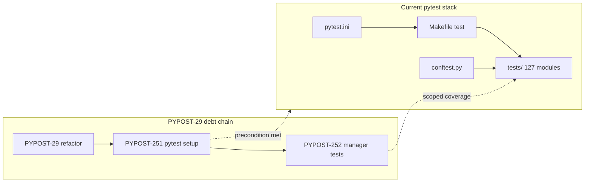

# PYPOST-251: Architecture — pytest debt verification

## Research

### Infrastructure inventory

| Component | Location | Role |
| --- | --- | --- |
| Pytest config | `pytest.ini` | Markers, 70% coverage gate, log_cli, slow exclusion |
| Test runner | `Makefile` `test`, `test-cov`, `test-slow`, `venv-test` | Local and CI entry points |
| Timeout enforcement | `tests/conftest.py` | Fails tests without explicit `pytest.mark.timeout` |
| Agent rules | `.cursor/lsr/do-testing.md` | Per-test timeout tiers |
| Dev docs | `doc/dev/testing.md` | Developer reference |
| CI | `.github/workflows/test.yml` | Matrix pytest runs |

### Suite scale (2026-06-12)

- **127** `tests/test_*.py` modules
- Focused smoke: `tests/test_request_manager.py` — 17 passed in 0.21s
- Manager coverage documented under PYPOST-252 in `doc/dev/testing.md`

## Implementation Plan

1. **Verify** — confirm config files and non-empty `tests/`; run focused pytest subset.
2. **Document** — record satisfied state in `ai-tasks/PYPOST-251/` artifacts.
3. **Cross-link** — note PYPOST-251 closure in `doc/dev/testing.md`; mark debt resolved in
   PYPOST-29 tech-debt file.
4. **Close** — transition Jira to Done; no production code changes.

## Architecture

## Patterns

No new patterns introduced. Existing conventions documented in `doc/dev/testing.md` and
`ai-tasks/PYPOST-252/20-architecture.md` apply.
