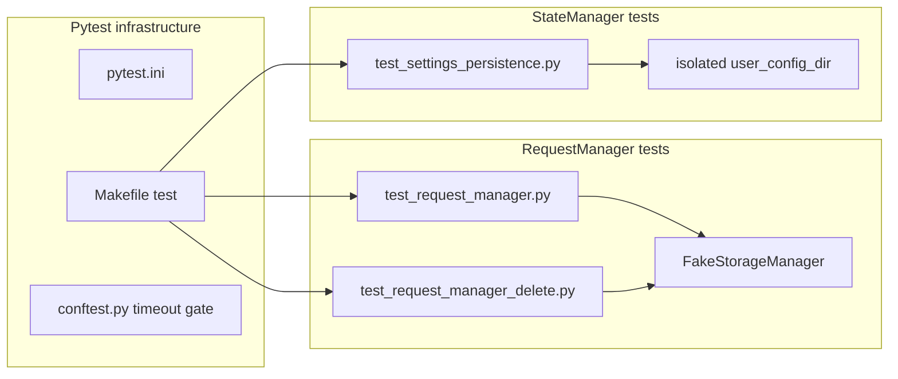

# PYPOST-252: Architecture for manager unit test coverage

## Research

### Existing infrastructure

| Component | Location | Role |
| --- | --- | --- |
| Pytest config | `pytest.ini` | Markers, coverage gate, log_cli |
| Test runner | `Makefile` `test`, `test-cov`, `venv-test` | Local/CI entry points |
| Timeout enforcement | `tests/conftest.py` | Fails tests without explicit timeout |
| Agent rules | `.cursor/lsr/do-testing.md` | Per-test timeout tiers |
| Dev docs | `doc/dev/testing.md` | Developer reference |

### Existing manager tests

| Module | Test file | Pattern |
| --- | --- | --- |
| `RequestManager` | `tests/test_request_manager.py` | `unittest.TestCase` + `FakeStorageManager` |
| `RequestManager` delete/rename | `tests/test_request_manager_delete.py` | Same fake storage |
| `StateManager` | `tests/test_settings_persistence.py` | Isolated config dir via `patch(user_config_dir)` |

`FakeStorageManager` lives in `tests/helpers/__init__.py` — in-memory collections, tracks
`saved_collections` and `deleted_collection_ids`.

## Implementation Plan

1. **Audit coverage** — run focused pytest with `--cov` on both manager modules.
2. **Gap fill** — add edge-case tests only for uncovered branches (not-found, empty name,
   unsupported type routing, debounced timer).
3. **Document** — add "Core manager unit tests" section to `doc/dev/testing.md`.
4. **Artifacts** — record satisfied infrastructure in `ai-tasks/PYPOST-252/`.

No production code changes required.

## Architecture

## Patterns

- **Storage isolation:** `FakeStorageManager` for `RequestManager`; no filesystem I/O.
- **Config isolation:** `tempfile` + `patch("pypost.core.config_manager.user_config_dir")`
  for `StateManager`.
- **Qt debounce:** `QTest.qWait(350)` with module `qapp` fixture; debounce interval is 300 ms.
- **Timeouts:** module `pytestmark = pytest.mark.timeout(60)` (RequestManager) or `120`
  (StateManager + SettingsDialog integration).
