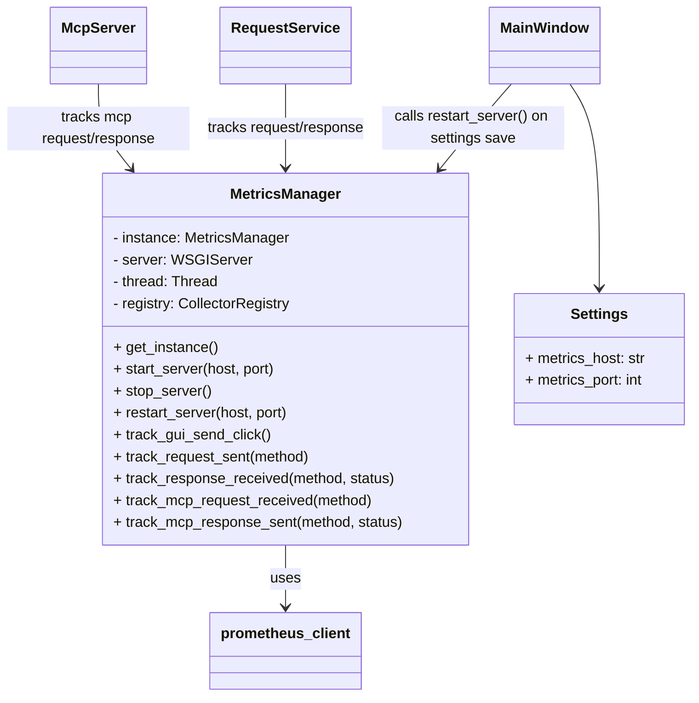

# PYPOST-26: Добавление метрик Prometheus для трассировки запросов

## Исследования

- **Библиотека `prometheus_client`**: Стандартная библиотека для экспорта метрик в Python. Позволяет запускать HTTP-сервер через `start_http_server`.
- **Интеграция с PyQt**: Запуск HTTP сервера является блокирующей операцией. Необходимо запускать его в отдельном потоке (`threading.Thread`).
- **Перезапуск сервера**: `prometheus_client.start_http_server` запускает сервер, который сложно остановить штатно без доступа к сокету или использования внутреннего API. Однако, можно использовать `make_wsgi_app` и запускать его через `wsgiref.simple_server` (или другой WSGI сервер), которым проще управлять (start/stop).
    - *Альтернатива*: Использовать `threading` и просто запускать новый сервер на новом порту, но старый порт может остаться занятым, если не остановить сервер корректно.
    - *Решение*: Использовать `wsgiref.simple_server.make_server` в отдельном потоке. Это позволяет вызывать `shutdown()` и `server_close()`.
- **Точки сбора метрик**:
    - GUI: `ResponseView` или `MainWindow` (сигнал нажатия кнопки).
    - Request: `RequestService` или `HttpClient`.
    - MCP: `McpServerImpl` или `McpServer`.

## План реализации

1.  **Модуль `metrics`**: Создать новый модуль `pypost/core/metrics.py`.
    - Класс `MetricsManager`: Singleton или глобальный объект.
    - Методы `start_server(host, port)`, `stop_server()`, `restart_server(host, port)`.
    - Определение метрик (Counter, Summary/Histogram) в `__init__`.
    - Методы-обертки для инкремента метрик (например, `track_gui_send_click()`).
2.  **Настройки**:
    - Обновить `pypost/models/settings.py`: добавить поля `metrics_host` (str, default '0.0.0.0') и `metrics_port` (int, default 9080).
    - Обновить `pypost/ui/dialogs/settings_dialog.py`: добавить поля ввода.
    - При сохранении настроек вызывать `MetricsManager.restart_server()`.
3.  **Инструментация**:
    - В `pypost/ui/widgets/request_editor.py` (или где кнопка Send) -> вызвать `track_gui_send_click()`.
    - В `pypost/core/request_service.py` или `http_client.py` -> `track_request_sent()`, `track_response_received()`.
    - В `pypost/core/mcp_server_impl.py` -> `track_mcp_request_received()`, `track_mcp_response_sent()`.
4.  **Инициализация**:
    - В `pypost/main.py` инициализировать `MetricsManager` при старте с параметрами из настроек.

## Архитектура

### Компоненты



### Детали реализации MetricsManager

Использование `wsgiref` для управляемого сервера.

```python
from prometheus_client import make_wsgi_app, CollectorRegistry
from wsgiref.simple_server import make_server
import threading

class MetricsManager:
    # ... singleton logic ...
    
    def start_server(self, host, port):
        self.stop_server() # Stop existing if any
        app = make_wsgi_app(registry=self.registry)
        self.server = make_server(host, port, app)
        self.thread = threading.Thread(target=self.server.serve_forever)
        self.thread.start()

    def stop_server(self):
        if self.server:
            self.server.shutdown()
            self.server.server_close()
            self.thread.join()
            self.server = None
```

## Вопросы и ответы

- **В:** Как обеспечить потокобезопасность метрик?
  **О:** `prometheus_client` потокобезопасен по умолчанию.
