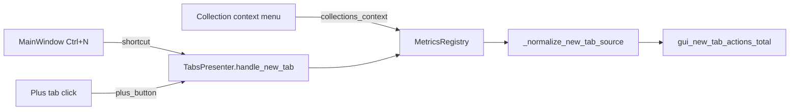

# PYPOST-264: New-tab metrics source validation

## Research

Existing implementation in `pypost/core/metrics_registry.py`:

- `_NEW_TAB_ACTION_SOURCES` frozenset: `plus_button`, `shortcut`, `unknown`, `collections_context`
- `_normalize_new_tab_source(source)` returns the source when allowed, else `"unknown"`
- `MetricsRegistry.track_gui_new_tab_action` normalizes before incrementing the counter

Call sites pass explicit strings:

| Call site | Source |
| --- | --- |
| `TabsPresenter` plus-tab signal | `plus_button` |
| `MainWindow` Ctrl+N shortcut | `shortcut` |
| `collection_tree_actions` context menu | `collections_context` |
| `handle_new_tab()` default | `unknown` |

## Implementation Plan

1. Confirm normalization helper and call-site wiring (no structural change required).
2. Extend regression tests to cover `collections_context` alongside existing cases.
3. Document normalization behavior in `doc/dev/request_actions.md`.

## Architecture

No new modules. Validation stays at the metrics boundary — callers remain plain strings; the
registry enforces the narrow label set.

## Interfaces

- `MetricsRegistry.track_gui_new_tab_action(source: str)` — normalizes `source` before label
  assignment.
- Allowed metric labels: `plus_button`, `shortcut`, `unknown`, `collections_context`; all other
  inputs become `unknown`.
