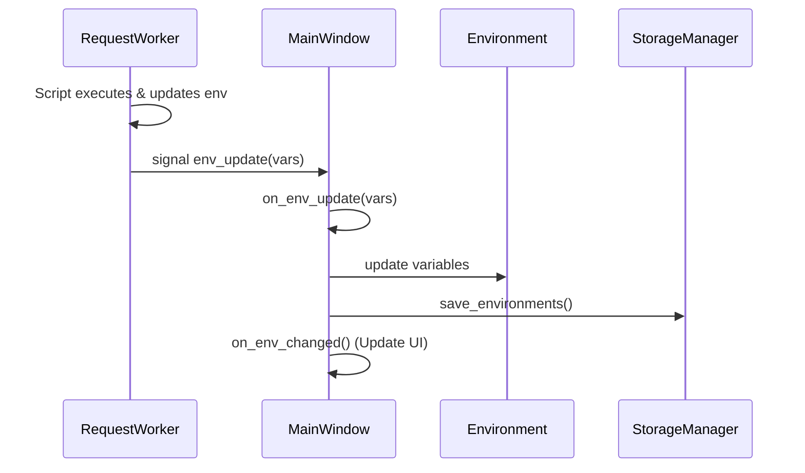

# PYPOST-27: Fix AttributeError: 'MainWindow' object has no attribute 'on_env_update'

## Research

Analysis of `pypost/ui/main_window.py` showed that in `handle_send_request` a signal connection is
created:
```python
worker.env_update.connect(lambda vars: self.on_env_update(vars))
```
However the `on_env_update` method is missing from the `MainWindow` class.
At the same time, there is `handle_variable_set_request` used for manual variable updates via UI.
Update logic should be similar.

## Implementation Plan

1.  Add method `on_env_update(self, vars: dict)` to `MainWindow` class
    (`pypost/ui/main_window.py`).
2.  Implement logic for updating current environment variables in this method.
3.  Ensure changes are saved and UI is updated.

## Architecture

### Changes in `pypost/ui/main_window.py`

`MainWindow` class:

```python
    def on_env_update(self, vars: dict):
        """
        Slot to handle environment variable updates from RequestWorker.
        """
        selected_env = self.env_selector.currentData()

        # If no environment is selected, we cannot update variables.
        # Can log a warning or ignore.
        if not isinstance(selected_env, Environment):
            return

        # Update variables in the environment object
        # vars is a dict with changed/new variables
        selected_env.variables.update(vars)

        # Save changes to disk
        self.storage.save_environments(self.environments)

        # Update UI (signal environment change so tabs etc. refresh)
        # Calling on_env_changed with current index will update all dependent components
        self.on_env_changed(self.env_selector.currentIndex())
```

### Interaction Diagram



## Q&A

No open questions. The task is localized and clear.

