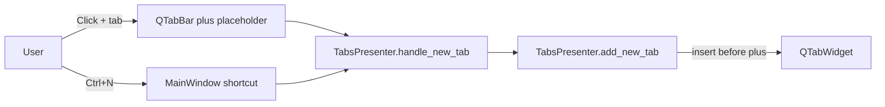

# PYPOST-293: Layout-Managed Tab Add Button

## Research

### Qt documentation

1. `QTabBar::setTabButton()` attaches a widget to a tab slot; the tab bar lays out tab geometry
   internally.  
   Source: https://doc.qt.io/qt-6/qtabbar.html#setTabButton
2. `QTabWidget::setCornerWidget()` places a widget in a tab-frame corner — layout-managed but
   anchored to the widget edge, not after the last tab when `setExpanding(False)`.  
   Source: https://doc.qt.io/qt-6/qtabwidget.html#setCornerWidget
3. `QTabWidget` positions its `QTabBar` child via direct geometry (no parent layout), so wrapping
   the tab bar in an external `QHBoxLayout` without subclassing `QTabWidget` fights internal
   resize logic.

### Codebase findings

- Tab UI lives in `TabsPresenter` (`pypost/ui/presenters/tabs_presenter.py`).
- Previous approach: floating `QPushButton` child of `QTabWidget` + `TabBarWithAddButton`
  `layout_changed` signal + `_position_add_tab_button()` manual coordinates.
- New-tab entry point: `handle_new_tab(source)` → metrics → `add_new_tab()`.

## Implementation Plan

1. Add a permanent trailing **plus placeholder tab** marked with `tabData == PLUS_TAB_MARKER`.
2. Embed the `+` control via `QTabBar.setTabButton(..., LeftSide, button)`.
3. Insert real request tabs before the plus tab; keep plus tab last after every add/close.
4. Handle `tabBarClicked` on the plus index → `handle_new_tab("plus_button")`.
5. Exclude plus tab from close, save-state, and tab-cycling logic.
6. Remove `TabBarWithAddButton`, floating button, and `_position_add_tab_button()`.
7. Add unit tests; update integration tests that counted raw `QTabWidget.count()`.

## Architecture

### Module diagram

### Components

| Component | Responsibility |
| --- | --- |
| `TabsPresenter._install_plus_tab()` | Creates trailing placeholder tab and `+` button widget |
| `TabsPresenter._on_tab_bar_clicked()` | Routes plus-tab clicks to new-tab handler |
| `TabsPresenter._plus_tab_index()` | Locates placeholder tab by `PLUS_TAB_MARKER` |
| `TabsPresenter.add_new_tab()` | Inserts request tabs before plus placeholder |
| `TabsPresenter.close_tab()` | Ignores close on plus tab; preserves ≥1 request tab |

### Patterns

- **Single entry handler**: `handle_new_tab()` for keyboard and mouse paths.
- **Qt tab-bar layout**: plus control is a tab-bar button widget, not a manually moved overlay.
- **Marker tabData**: distinguishes plus placeholder from request tabs without string labels.

## Q&A

- **Q:** Why a placeholder tab instead of a corner widget?  
  **A:** Preserves “after last tab” placement using native tab-bar layout.
- **Q:** Does `QTabWidget.count()` include the plus tab?  
  **A:** Yes — business logic uses `isinstance(widget, RequestTab)` or `_request_tab_count()`.
