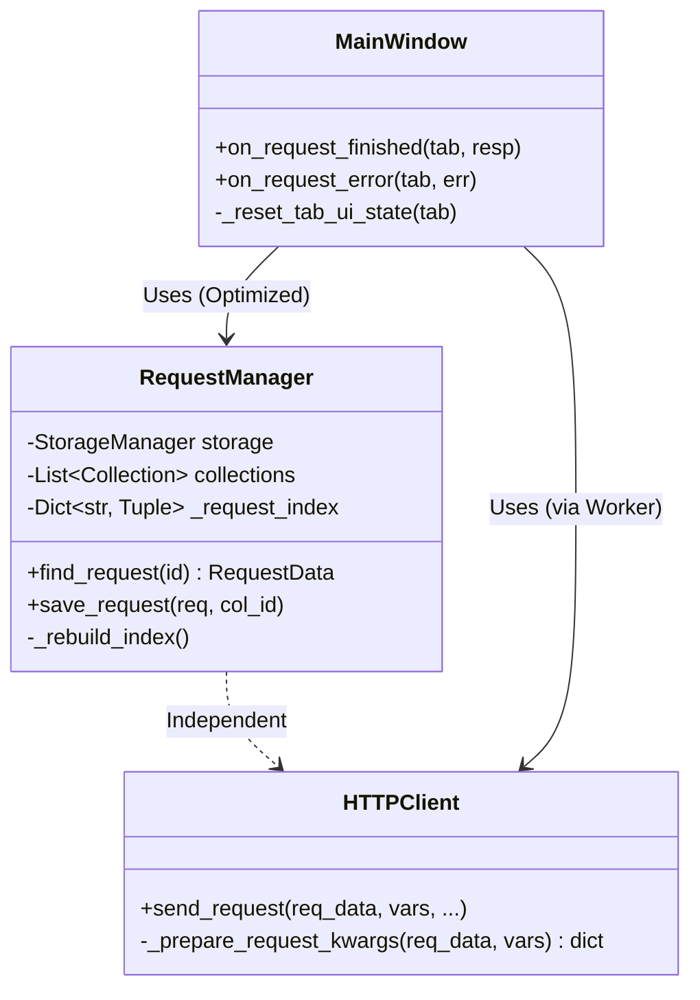

# PYPOST-30: Refactoring Technical Debt

## Research

Since this task focuses on refactoring existing components, deep external research is not required. Analysis of the current code showed the following:

1.  **RequestManager**:
    - Current `find_request` implementation uses nested loops, resulting in O(M*N) complexity, where M is the number of collections and N is the average number of requests per collection.
    - In Python, using `dict` provides O(1) access.
    - The index needs to be kept in sync when requests are added/modified.

2.  **HTTPClient**:
    - The `send_request` method performs two different responsibilities: data preparation (templating) and executing the network request.
    - The `requests` library accepts parameters via `kwargs`, which is convenient for passing prepared data.

3.  **MainWindow**:
    - Repeated code in `on_request_finished` and `on_request_error` slots only concerns the UI elements of the tab (`RequestTab`).

## Implementation Plan

1.  **RequestManager Refactoring**:
    - Add private attribute `_request_index: Dict[str, Tuple[RequestData, Collection]]`.
    - Implement method `_rebuild_index()`.
    - Update `reload_collections`, `save_request` (and `create_collection` if needed) methods to trigger index rebuild or update.
    - Rewrite `find_request`.

2.  **HTTPClient Refactoring**:
    - Create method `_prepare_request_kwargs(self, request_data: RequestData, variables: Dict) -> dict`.
    - Move `template_service.render_string` logic inside this method.
    - Use this method at the beginning of `send_request`.

3.  **MainWindow Refactoring**:
    - Create method `_reset_tab_ui_state(self, tab: RequestTab)`.
    - Include: enabling Send button, resetting button text, clearing worker reference.
    - Replace duplicate code with calls to this method.

## Architecture

### Component Diagram (Mermaid)

### Module Changes

#### `pypost/core/request_manager.py`

- **New State**: `self._request_index` for caching request locations.
- **Changed Behavior**: Search becomes instantaneous. Saving requires index update (negligible overhead).

#### `pypost/core/http_client.py`

- **Refactoring**: Separation of concerns. Public API remains unchanged, but internal structure becomes cleaner.

#### `pypost/ui/main_window.py`

- **Refactoring**: Extraction of common UI logic code.

## Q&A

- **Does RequestManager change affect thread safety?**
  - No, `RequestManager` works in the main thread (or is called synchronously). If access from multiple threads is needed in the future, a lock on the index will be required. Not needed now.

- **Should send_request signature be changed?**
  - No, the signature remains the same to avoid breaking compatibility with `RequestWorker`.

