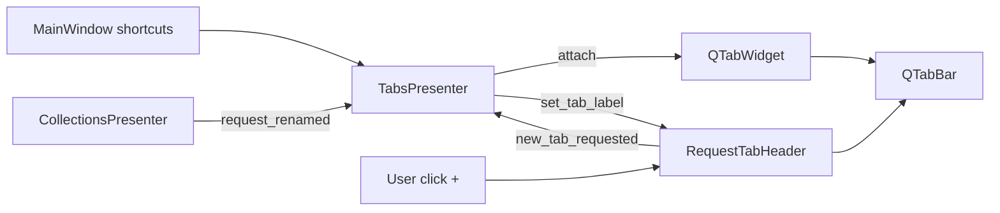

# PYPOST-302: Refactor Tab Action Controls into Dedicated Tab-Header Component

## Research

### Qt documentation

1. `QTabBar::setTabButton()` attaches per-tab widgets; used for the layout-managed `+` control.
   Source: https://doc.qt.io/qt-6/qtabbar.html#setTabButton
2. `QTabWidget::setTabBar()` allows injecting a custom tab bar instance.
   Source: https://doc.qt.io/qt-6/qtabwidget.html#setTabBar

### Codebase findings

- PYPOST-293 placed plus-tab logic in `TabsPresenter` (`_install_plus_tab`, `_on_tab_bar_clicked`).
- `MainWindow` already delegates tab shortcuts to `TabsPresenter.handle_new_tab`.
- Collection rename flows call `TabsPresenter.rename_request_tabs` → `_sync_tab_labels_for_request`.
- Tests in `tests/test_tabs_presenter.py` cover plus-tab and rename behavior.

## Implementation Plan

1. Add `RequestTabHeader` in `pypost/ui/widgets/tab_header.py`.
2. Move plus-tab constants and tab-bar setup into the header.
3. Expose header API: `attach`, `ensure_plus_tab`, `plus_tab_index`, `is_plus_tab_index`,
   `navigable_tab_indices`, `insert_index_before_plus`, `set_tab_label`, `new_tab_requested`.
4. Refactor `TabsPresenter` to compose `RequestTabHeader` and remove duplicated methods.
5. Add `tests/test_tab_header.py`; run full tab presenter suite.
6. Update `doc/dev/request_actions.md`.

## Architecture

### Module diagram

### Modules and responsibilities

| Module | Responsibility |
| --- | --- |
| `RequestTabHeader` | Tab-bar chrome: closable setup, plus placeholder, label text updates |
| `TabsPresenter` | Request tab lifecycle, save/send, rename matching by request id |
| `MainWindow` | Shortcuts and signal wiring (unchanged) |

### Patterns

- **Composition**: presenter owns header; header owns tab-bar mechanics.
- **Signal boundary**: `new_tab_requested` connects to `handle_new_tab("plus_button")`.
- **Marker tabData**: `PLUS_TAB_MARKER` distinguishes plus placeholder from request tabs.

### Main interfaces

- `RequestTabHeader.attach(tab_widget: QTabWidget) -> None`
- `RequestTabHeader.new_tab_requested` signal
- `RequestTabHeader.set_tab_label(index: int, label: str) -> None`
- `TabsPresenter.rename_request_tabs(request_id, new_name)` — unchanged public API

## Q&A

- Q: Why `QObject` wrapper instead of subclassing `QTabBar`?
  - A: Plus tab requires both `QTabWidget` and `QTabBar` coordination; a coordinator keeps APIs
    explicit without fighting Qt internals.
