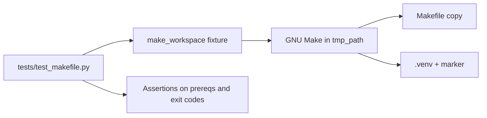

# PYPOST-307: Architecture for Makefile automation tests

## Research

### External research

1. GNU Make manual documents `.PHONY`, file targets, and `make -p` for dumping the internal
   rule database (prerequisite inspection).
   Source: https://www.gnu.org/software/make/manual/html_node/Phony-Targets.html
2. pytest subprocess patterns recommend isolated fixtures and explicit timeouts for
   integration tests that spawn external commands.
   Source: https://docs.pytest.org/en/stable/how-to/fixtures.html
3. Python `venv` module documents version-specific environment directories and interpreter
   layout used by the project marker convention.
   Source: https://docs.python.org/3/library/venv.html

### Current codebase findings

1. `Makefile` defines `VENV_MARKER := $(VENV)/.initialized-$(PYTHON_VERSION)` and wires
   `venv`, `venv-test`, `install`, `run`, `test`, `lint`, and `clean` targets.
2. `doc/dev/setup.md` documents marker semantics and that `run`/`test`/`lint` depend on the
   marker only (not `install`).
3. No `tests/test_makefile*.py` exists; Makefile behavior is validated manually.
4. `tests/conftest.py` enforces per-test `pytest.mark.timeout` markers.

## Implementation Plan

1. Add `tests/test_makefile.py` with module-level `pytestmark = pytest.mark.timeout(120)`.
2. Fixture `make_workspace`: copy `Makefile` (and minimal `requirements.txt` when needed) into
   `tmp_path` for isolated runs.
3. **Marker lifecycle tests**: `make venv` → assert marker path; `make clean` → marker gone;
   second `make venv` exits 0 quickly.
4. **Dependency chain tests**: parse `make -p` output for prerequisite lists of key targets;
   assert `install` includes `venv-test`; assert `test`/`run`/`lint` depend on the marker
   file rule, not on `install`.
5. **Exit behavior tests**: `make clean`/`make venv` return 0; unknown target returns non-zero;
   `make lint` on bare venv (no flake8) returns non-zero.
6. Update `doc/dev/testing.md` with a Makefile test section.

## Architecture

### Module diagram

### Components

| Component | Responsibility |
| --------- | -------------- |
| `make_workspace` fixture | Isolated directory with Makefile copy |
| `_run_make` helper | Subprocess wrapper with timeout and cwd |
| `_prerequisites` helper | Parse `make -p` for target prerequisites |
| Test classes | Group marker, dependency, and exit-code cases |

### Interfaces

- **Input**: repository `Makefile`, system `make` and `python3`.
- **Output**: pytest pass/fail; no changes to production `pypost/` code.

## Patterns

- **Arrange-Act-Assert** per test case.
- **Test isolation** via `tmp_path` — never mutate repo-root `.venv`.
- **Black-box Make invocation** — tests observe exit codes and filesystem effects only.
