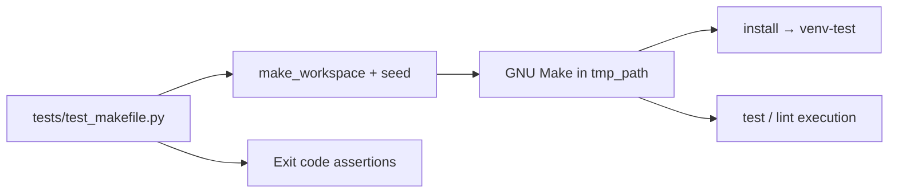

# PYPOST-310: Architecture for Make target execution tests

## Research

### Current codebase findings

1. [PYPOST-307](https://pypost.atlassian.net/browse/PYPOST-307) added `tests/test_makefile.py`
   with `make_workspace`, `_run_make`, `_prerequisites`, marker lifecycle, prerequisite
   parsing, and bare-venv `lint` failure.
2. PYPOST-307 tech debt noted missing full `install` execution and `test` target runs.
3. `Makefile` wires `install` → `venv-test` (pytest, flake8); `test` depends on marker only.

## Implementation Plan

1. Extend `make_workspace` to seed minimal `tests/test_noop.py` and `pypost/__init__.py`.
2. Add `TestTargetExecution` with install/test/lint execution assertions.
3. Update `doc/dev/testing.md` to document PYPOST-307 vs PYPOST-310 scope split.

## Architecture

### Components

| Component | Responsibility |
| --------- | -------------- |
| `_seed_minimal_project` | Minimal `tests/` and `pypost/` for target execution |
| `TestTargetExecution` | Success/failure exit codes after install or bare venv |
| `doc/dev/testing.md` | PYPOST-307 baseline + PYPOST-310 execution scope |

## Patterns

- Reuse PYPOST-307 isolation model — no changes to production layout beyond copied Makefile.
- Black-box subprocess checks only.
