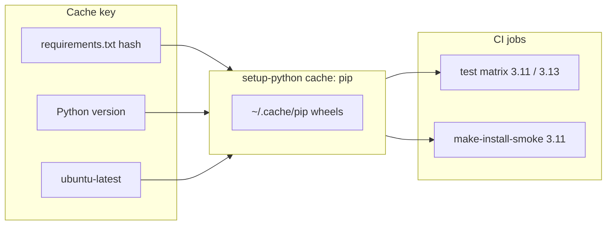

# PYPOST-311: Architecture for CI dependency caching

## Research

### Current codebase findings

1. `.github/workflows/test.yml` already sets `cache: pip` on `actions/setup-python@v5` for
   both jobs but omits explicit `cache-dependency-path`.
2. Without `cache-dependency-path`, `setup-python` auto-detects dependency files; explicit
   `requirements.txt` makes invalidation predictable and auditable.
3. The main `test` job installs pytest tooling then `requirements.txt`; the
   `make-install-smoke` job installs pytest only — slow tests run `make install` in `tmp_path`,
   which still benefits from restored pip wheel cache on the runner.
4. Job summary and artifact upload steps were misplaced under `make-install-smoke` (referencing
   `matrix.python-version` and files produced only by the main job).

## Implementation Plan

1. Add `cache-dependency-path: requirements.txt` to both `setup-python` steps.
2. Move junit/coverage summary and artifact upload steps from `make-install-smoke` to `test`.
3. Document caching behavior, cache key, and invalidation in `doc/dev/testing.md`.

## Architecture

### Components

| Component | Responsibility |
| --------- | -------------- |
| `setup-python@v5` + `cache: pip` | Restore/save pip download cache per OS + Python + dependency hash |
| `cache-dependency-path: requirements.txt` | Explicit invalidation when app dependencies change |
| Main `test` job | Fast pytest matrix; consumes cached wheels for app + test installs |
| `make-install-smoke` job | Slow Makefile install; pip cache speeds `make install` in isolated venv |

## Q&A

- **Separate caches per Python version?** Yes — `setup-python` scopes cache by
  `python-version`, so 3.11 and 3.13 maintain independent entries keyed on the same
  `requirements.txt` hash.
