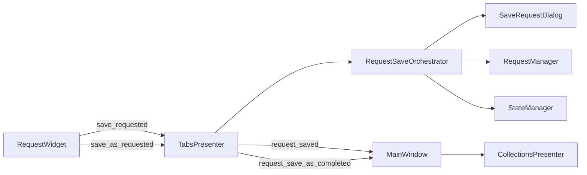

# PYPOST-316: Architecture — MainWindow Save Extraction

## Research

### Current codebase (post PYPOST-322)

1. `RequestSaveOrchestrator` in `pypost/ui/request_save_orchestrator.py` owns dialogs,
   overwrite/stale confirmations, and `RequestManager` persistence.
2. `TabsPresenter._handle_save_request` / `_handle_save_as_request` delegate to the
   orchestrator and apply tab updates plus signals.
3. `MainWindow._wire_signals` connects presenter save signals to collections refresh only:
   - `request_saved` → `refresh_tree`, `restore_tree_state`
   - `request_save_as_completed` → `add_saved_request_to_tree`
4. `MainWindow` has no `handle_save_*` methods.

### PYPOST-34 debt item

Original concern: save flows concentrated in one large class. Resolution splits responsibilities:

| Layer | Save responsibility |
| ----- | ------------------- |
| `RequestWidget` | Emit `save_requested` / `save_as_requested` |
| `TabsPresenter` | Delegate to orchestrator; tab labels, baselines, signals |
| `RequestSaveOrchestrator` | Dialogs, confirmations, persistence |
| `MainWindow` | Cross-presenter signal wiring only |

## Implementation Plan

No further code extraction required — verify existing split and document closure.

1. Confirm orchestrator module and presenter delegation (Step 3 verification).
2. Document architecture in dev docs (`doc/dev/request_actions.md` — already updated).
3. Close PYPOST-316 as debt resolved by PYPOST-322.

## Module Diagram

## Q&A

| Question | Answer |
| -------- | ------ |
| Why keep collections refresh in MainWindow? | Cross-presenter coordination is the composition root's role. |
| New public API? | `RequestSaveOrchestrator.save_request` / `save_as_request` → `SaveResult`. |
