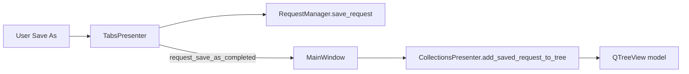
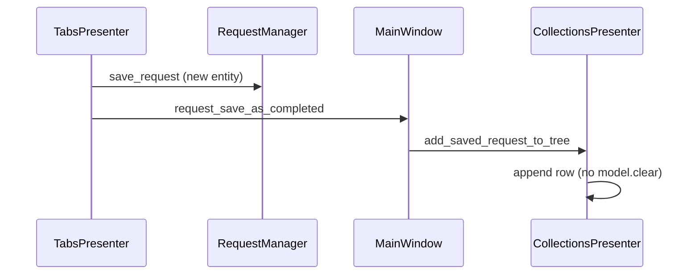

# PYPOST-319: Architecture for Save As Incremental Tree Update

## Research

### Current codebase findings

1. `TabsPresenter._handle_save_as_request` persisted a new entity then emitted `request_saved`.
2. `MainWindow` wired `request_saved` to `CollectionsPresenter.refresh_tree()` and
   `restore_tree_state()` — full model clear/rebuild plus expansion replay.
3. `CollectionsPresenter` already supports incremental delete via `remove_item_from_tree` and
   incremental rename via in-place item text updates (PYPOST-326 patterns).
4. PYPOST-47 removed redundant disk reload on save; remaining cost is UI model rebuild.

## Implementation Plan

1. Extract `_make_collection_item` / `_make_request_item` helpers from `refresh_tree`.
2. Add `add_saved_request_to_tree(request, collection_id)`:
   - append request under existing collection row, or
   - insert whole collection row when save-as created a new collection.
3. Add `request_save_as_completed(RequestData, collection_id)` on `TabsPresenter`; emit from
   save-as handler instead of `request_saved`.
4. Wire `MainWindow`: `request_save_as_completed` → `add_saved_request_to_tree`.
5. Tests: presenter incremental insert (existing + new collection); tabs signal routing.
6. Update `doc/dev/collection_loading.md`.

## Architecture

### Module diagram

### Sequence: save-as (optimized)

### Component changes

| Module | Change |
|--------|--------|
| `collections_presenter.py` | Item builders, `add_saved_request_to_tree`, expand helper |
| `tabs_presenter.py` | `request_save_as_completed` signal |
| `main_window.py` | Wire save-as to incremental update |
| `tests/test_collections_presenter.py` | Incremental insert tests |
| `tests/test_tabs_presenter.py` | Signal routing test |
| `doc/dev/collection_loading.md` | Document save-as path |

### Risks

- **Collection row missing:** if tree and RequestManager diverge, method falls back to inserting
  from `get_collections()`; logs warning on total failure.
- **Regular save unchanged:** still uses full refresh — acceptable per scope.

## Q&A

| Question | Answer |
|----------|--------|
| Why a new signal? | Keeps regular save on proven refresh path; save-as gets dedicated wiring. |
| Why not call presenter from TabsPresenter directly? | Preserves MainWindow as composition root (existing pattern). |
