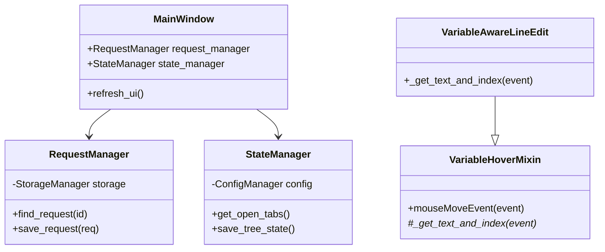

# PYPOST-32: Technical Debt Refactoring Architecture

## Исследования

Поскольку задача является чисто рефакторингом (без добавления новой бизнес-логики), исследования сосредоточены на анализе текущей кодовой базы для определения точек разрыва зависимостей.

### Текущая структура зависимостей (Проблемная)
- **MainWindow**
  - Напрямую управляет `StorageManager` для загрузки/сохранения коллекций.
  - Напрямую взаимодействует с `ConfigManager` и `AppSettings` для сохранения состояния UI (expanded nodes, tabs).
  - Содержит бизнес-логику поиска запроса по ID (`restore_tabs`, `save_request`).
  - Содержит логику создания и обновления запросов.
- **VariableAware Widgets**
  - Дублируют код `mouseMoveEvent` и использование `VariableHoverHelper`.

### Целевая структура
Внедрение паттерна "Service/Manager" для изоляции бизнес-логики и паттерна "Mixin" для переиспользования кода UI.

## Архитектура

### Новые компоненты

#### 1. `RequestManager` (Service)
**Ответственность**: Управление жизненным циклом запросов и коллекций.
**Зависимости**: `StorageManager`.
**Методы**:
- `get_collections() -> List[Collection]`
- `find_request(request_id: str) -> Optional[Tuple[RequestData, Collection]]`
- `save_request(request: RequestData, collection_id: str) -> None`
- `create_request(collection_id: str, request: RequestData) -> None`
- `delete_request(request_id: str) -> None`

#### 2. `StateManager` (Service)
**Ответственность**: Управление персистентным состоянием UI, абстрагируя структуру конфигурации.
**Зависимости**: `ConfigManager`.
**Методы**:
- `get_expanded_collections() -> List[str]`
- `set_expanded_collections(ids: List[str]) -> None`
- `get_open_tabs() -> List[str]`
- `set_open_tabs(ids: List[str]) -> None`
- `get_last_environment_id() -> Optional[str]`
- `set_last_environment_id(id: str) -> None`

#### 3. `VariableHoverMixin` (UI Mixin)
**Ответственность**: Предоставление функционала всплывающих подсказок для переменных.
**Использование**: Наследуется виджетами (`VariableAwareLineEdit`, `VariableAwarePlainTextEdit`).
**Абстрактные методы** (которые должны реализовать наследники):
- `_get_text_at_cursor(event) -> Tuple[str, int]` (текст и индекс)

### Диаграмма взаимодействия (Mermaid)

## План реализации

1.  **Core Refactoring**:
    - Создать `pypost/core/request_manager.py`. Перенести логику поиска/сохранения из `MainWindow`.
    - Создать `pypost/core/state_manager.py`. Перенести логику работы с `AppSettings` (касательно UI state).
2.  **UI Refactoring (Widgets)**:
    - Создать `pypost/ui/widgets/mixins.py` с `VariableHoverMixin`.
    - Обновить виджеты в `pypost/ui/widgets/variable_aware_widgets.py` для использования миксина.
3.  **MainWindow Integration**:
    - Внедрить `RequestManager` и `StateManager` в `MainWindow`.
    - Заменить прямые вызовы `storage` и циклы поиска на вызовы менеджеров.

## Вопросы и ответы

- **Почему не использовать полноценный DI container?**
  - Для текущего масштаба приложения (Python/PySide6) это избыточно. Простая инициализация в `main.py` или `MainWindow.__init__` ("Composition Root") достаточна.

