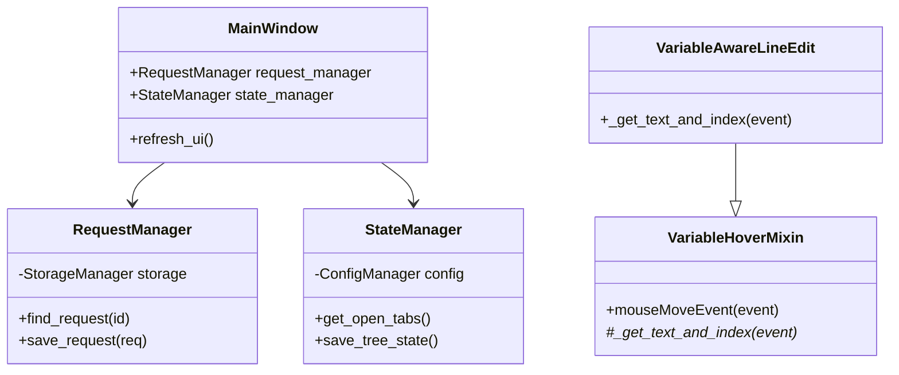

# PYPOST-32: Technical Debt Refactoring Architecture

## Research

Since the task is purely refactoring (without adding new business logic), research is focused on analyzing the current codebase to identify dependency breaking points.

### Current Dependency Structure (Problematic)
- **MainWindow**
  - Directly manages `StorageManager` for loading/saving collections.
  - Directly interacts with `ConfigManager` and `AppSettings` for saving UI state (expanded nodes, tabs).
  - Contains business logic for finding request by ID (`restore_tabs`, `save_request`).
  - Contains logic for creating and updating requests.
- **VariableAware Widgets**
  - Duplicate `mouseMoveEvent` code and usage of `VariableHoverHelper`.

### Target Structure
Implementation of the "Service/Manager" pattern to isolate business logic and the "Mixin" pattern for reusing UI code.

## Architecture

### New Components

#### 1. `RequestManager` (Service)
**Responsibility**: Managing the lifecycle of requests and collections.
**Dependencies**: `StorageManager`.
**Methods**:
- `get_collections() -> List[Collection]`
- `find_request(request_id: str) -> Optional[Tuple[RequestData, Collection]]`
- `save_request(request: RequestData, collection_id: str) -> None`
- `create_request(collection_id: str, request: RequestData) -> None`
- `delete_request(request_id: str) -> None`

#### 2. `StateManager` (Service)
**Responsibility**: Managing persistent UI state, abstracting the configuration structure.
**Dependencies**: `ConfigManager`.
**Methods**:
- `get_expanded_collections() -> List[str]`
- `set_expanded_collections(ids: List[str]) -> None`
- `get_open_tabs() -> List[str]`
- `set_open_tabs(ids: List[str]) -> None`
- `get_last_environment_id() -> Optional[str]`
- `set_last_environment_id(id: str) -> None`

#### 3. `VariableHoverMixin` (UI Mixin)
**Responsibility**: Providing tooltip functionality for variables.
**Usage**: Inherited by widgets (`VariableAwareLineEdit`, `VariableAwarePlainTextEdit`).
**Abstract Methods** (which inheritors must implement):
- `_get_text_at_cursor(event) -> Tuple[str, int]` (text and index)

### Interaction Diagram (Mermaid)

## Implementation Plan

1.  **Core Refactoring**:
    - Create `pypost/core/request_manager.py`. Move search/save logic from `MainWindow`.
    - Create `pypost/core/state_manager.py`. Move logic for working with `AppSettings` (regarding UI state).
2.  **UI Refactoring (Widgets)**:
    - Create `pypost/ui/widgets/mixins.py` with `VariableHoverMixin`.
    - Update widgets in `pypost/ui/widgets/variable_aware_widgets.py` to use the mixin.
3.  **MainWindow Integration**:
    - Inject `RequestManager` and `StateManager` into `MainWindow`.
    - Replace direct calls to `storage` and search loops with calls to managers.

## Q&A

- **Why not use a full DI container?**
  - For the current scale of the application (Python/PySide6), this is excessive. Simple initialization in `main.py` or `MainWindow.__init__` ("Composition Root") is sufficient.

