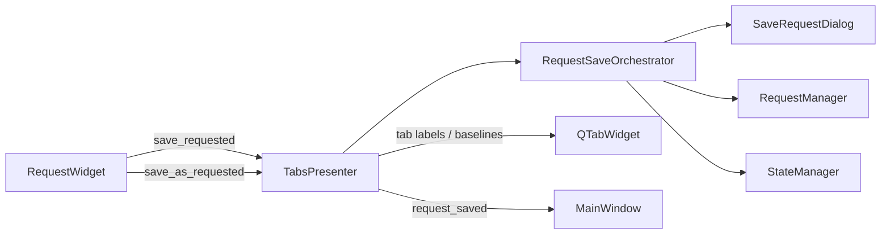

# PYPOST-322: Architecture — Extract Request Save Orchestrator

## Research

- Save/save-as handlers live in `TabsPresenter._handle_save_request` and
  `_handle_save_as_request` (~150 lines combined).
- `MainWindow` only wires `request_saved` / `request_save_as_completed` to collections refresh.
- `RequestService` in `core/` handles HTTP execution, not GUI save flows.
- Existing tests patch `SaveRequestDialog` and drive presenter handlers directly.

## Implementation Plan

1. Add `pypost/ui/request_save_orchestrator.py`:
   - `RequestSaveOrchestrator` — dialogs, confirmations, `RequestManager` calls.
   - `SaveResult` / `SaveAction` — structured outcomes for the presenter.
   - `StaleCheckContext` — tab baseline passed in for overwrite stale checks.
2. Inject orchestrator in `TabsPresenter.__init__`.
3. Slim handlers to: call orchestrator → apply tab updates → emit signals.
4. Add `tests/test_request_save_orchestrator.py`; update dialog patch paths in presenter tests.

## Module Diagram

## Responsibilities

| Component | Role |
| --------- | ---- |
| `RequestWidget` | Emit save intents with `RequestData` snapshots |
| `RequestSaveOrchestrator` | Dialogs, overwrite/stale confirmation, persistence, metrics |
| `TabsPresenter` | Tab rebinding, `request_saved` / `request_save_as_completed` signals |
| `MainWindow` | Collections tree refresh on save signals |

## Q&A

| Question | Answer |
| -------- | ------ |
| Why keep tab updates in presenter? | Tab widget state is presenter-owned; orchestrator returns data outcomes only. |
| New public API? | `RequestSaveOrchestrator.save_request` / `save_as_request` returning `SaveResult`. |
