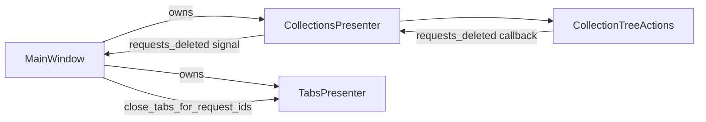

# PYPOST-324: Architecture — context-menu delete extraction

## Target layout

| Component | Delete responsibility |
|-----------|---------------------|
| `MainWindow` | Signal wiring only: `collections.requests_deleted` → `tabs.close_tabs_for_request_ids` |
| `CollectionsPresenter` | Tree model, `customContextMenuRequested` → `CollectionTreeActions` |
| `CollectionTreeActions` | Context menu, `confirm_delete`, metrics, `handle_delete`, tree sync |
| `collection_item_dialogs` | Shared QMessageBox helpers |

## Implementation status

Extraction is complete in the codebase:

1. `CollectionTreeActions.show_context_menu` builds Delete action and calls `handle_delete`.
2. `CollectionsPresenter` constructs `CollectionTreeActions` and connects the tree view.
3. `MainWindow` has no delete-flow methods (guarded by `test_main_window_has_no_collection_delete_flow_methods`).

## Q&A

- **Q:** Why keep tab closure in `MainWindow`? **A:** Composition root wires cross-presenter
  signals; tab lifecycle belongs to `TabsPresenter`.
