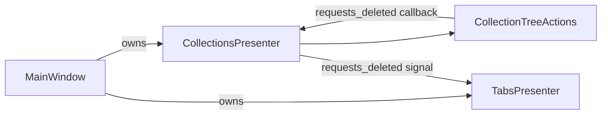

# PYPOST-326: Architecture

## Current layout (target state)

| Component | Delete-related responsibility |
|-----------|----------------------------|
| `MainWindow` | Wire `collections.requests_deleted` → `tabs.close_tabs_for_request_ids` |
| `CollectionsPresenter` | Tree model, wiring to `CollectionTreeActions` |
| `CollectionTreeActions` | Context menu, confirmation, metrics, `handle_delete` |

## Implementation plan

1. Confirm `MainWindow` has no delete-flow methods (already true after PYPOST-43/349).
2. Remove thin presenter delegates (`_show_context_menu`, `_handle_delete`,
   `_on_editor_closed`) — tests call `CollectionTreeActions` directly.
3. Add `test_main_window_has_no_collection_delete_flow_methods` regression guard.

## Q&A

- Q: Was code moved in this task?
  A: Boundary was established in prior refactors; this task finalizes tests and removes
  leftover delegation shims.
