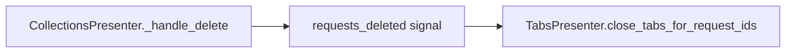

# PYPOST-332: Add tests for open-tab behavior after collection item delete

## Research

- `CollectionsPresenter._handle_delete` emits `requests_deleted` with affected request IDs after a
  successful `RequestManager.delete_collection_item` call.
- `TabsPresenter.close_tabs_for_request_ids` removes tabs whose `request_data.id` is in the list,
  adds a blank tab if none remain, and calls `save_tabs_state`.
- `MainWindow` wires the signal: `collections.requests_deleted.connect(tabs.close_tabs_for_request_ids)`.
- Existing presenter unit tests use `FakeRequestManager` / `FakeStateManager` patterns in
  `tests/test_collections_presenter.py` and `tests/test_tabs_presenter.py`.
- Integration test precedent: `tests/test_new_variable_flow_integration.py` connects presenter
  signals without `MainWindow`.

## Implementation Plan

1. Extend `tests/test_tabs_presenter.py`:
   - Empty `request_ids` list is a no-op.
   - Multiple tabs for the same request ID all close.
   - Persisted open-tab state is updated after closure.
2. Add `tests/test_delete_open_tabs_integration.py`:
   - Connect `requests_deleted` → `close_tabs_for_request_ids` (mirrors `MainWindow`).
   - Request delete closes matching tab, leaves unrelated tabs.
   - Collection delete closes all affected tabs and leaves a blank tab.
   - Persisted tab state reflects closure.
3. Rely on existing `tests/test_collections_presenter.py` signal tests (no changes needed).
4. Document test commands in `doc/dev/collection_item_delete.md`.

## Architecture

Test layers:

| Layer | File | What is verified |
| --- | --- | --- |
| Signal emission | `test_collections_presenter.py` | Correct request IDs emitted |
| Tab closure | `test_tabs_presenter.py` | Tab widget and state behavior |
| Wiring | `test_delete_open_tabs_integration.py` | End-to-end presenter connection |

## Test Doubles

- `CollectionsFakeRequestManager` — in-memory collections with `delete_collection_item`.
- `TabsFakeRequestManager` — lookup map for open-tab restore paths.
- `FakeStateManager` — tracks `open_tabs` for persistence assertions.
- `FakeMetrics` — no-op delete/rename telemetry.
