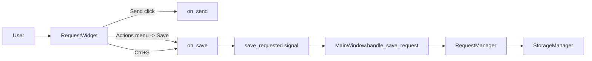

# PYPOST-34: Consolidate Save into Actions Menu on Main Screen

## Research

### External research (official Qt docs)

1. `QToolButton` supports popup menus and is intended for compact action presentation.
   - Source: https://doc.qt.io/qt-6/qtoolbutton.html
2. `QMenu` can host `QAction` items and is the standard way to expose contextual actions.
   - Source: https://doc.qt.io/qt-6/qmenu.html
3. `QAction` supports shortcuts and centralizes action behavior independently from a specific
   button widget.
   - Source: https://doc.qt.io/qt-6/qaction.html
4. Qt shortcut handling is built around `QShortcut`/`QKeySequence`; `Ctrl+S` should remain
   mapped to the same save behavior.
   - Sources:
     - https://doc.qt.io/qt-6/qshortcut.html
     - https://doc.qt.io/qt-6/qkeysequence.html

### Current codebase findings

1. Main request actions are built in `pypost/ui/widgets/request_editor.py`.
2. Current layout order is: method selector, URL input, `MCP Tool`, `Save`, `Send`.
3. Save workflow endpoint is already centralized in `RequestWidget.on_save()`, which emits
   `save_requested`.
4. `MainWindow` listens to `save_requested` and executes actual save business logic in
   `handle_save_request`, so UI placement can change without changing save domain behavior.

## Implementation Plan

1. Keep business flow unchanged: preserve `save_requested -> MainWindow.handle_save_request`.
2. Replace standalone `Save` button in `RequestWidget` with an `Actions` control to the right
   of `Send`.
3. Implement `Actions` as a `QToolButton` with `QMenu`.
4. Add one `QAction`: `Save`, triggered by existing `on_save()` method.
5. Preserve keyboard behavior by keeping `Ctrl+S` shortcut bound to save.
6. Keep this change local to the main screen request editor; do not modify other screens.

## Architecture

### Module Diagram

### Modules and Responsibilities

1. `RequestWidget` (`pypost/ui/widgets/request_editor.py`)
   - Owns main-screen request action controls.
   - Translates UI events (click/menu/shortcut) into existing signals.
2. `MainWindow` (`pypost/ui/main_window.py`)
   - Orchestrates tab-level behavior.
   - Receives save/send signals and routes to core services.
3. `RequestManager` (`pypost/core/request_manager.py`)
   - Owns request persistence rules and collection management.
4. `StorageManager` (`pypost/core/storage.py`)
   - Persists collections/environments/config data.

### Dependencies

1. `RequestWidget` depends on Qt Widgets (`QToolButton`, `QMenu`, `QAction`, `QShortcut`).
2. `MainWindow` depends on `RequestWidget` public signals only.
3. Save persistence path remains `MainWindow -> RequestManager -> StorageManager`.

### Selected Patterns and Justification

1. Signal-slot pattern (existing, preserved)
   - Keeps UI control changes decoupled from business save logic.
2. Action pattern via `QAction`
   - Encapsulates save behavior as an action reusable from menu and shortcut.
3. Presenter-like UI orchestration in `MainWindow`
   - Maintains current separation: widget emits intents, main window coordinates services.

### Main Interfaces / APIs

1. `RequestWidget.save_requested: Signal(RequestData)` (unchanged)
2. `RequestWidget.send_requested: Signal(RequestData)` (unchanged)
3. `RequestWidget.on_save()` (reused by menu action and shortcut)
4. `MainWindow.handle_save_request(request_data: RequestData)` (unchanged)

### Interaction Scheme

1. User clicks `Actions` control near `Send`.
2. User selects `Save`.
3. `QAction` triggers `RequestWidget.on_save()`.
4. `RequestWidget` updates request model and emits `save_requested`.
5. `MainWindow` executes existing save flow and updates UI/tree/tab state.

## Q&A

- Q: Why use `QToolButton + QMenu` instead of another `QPushButton`?
  - A: It is a standard Qt mechanism for grouped actions and future menu growth.
- Q: Will save behavior change?
  - A: No. The same `on_save()` and `save_requested` path is preserved.
- Q: How is keyboard accessibility preserved?
  - A: `Ctrl+S` remains bound to save, and menu action maps to the same save handler.
