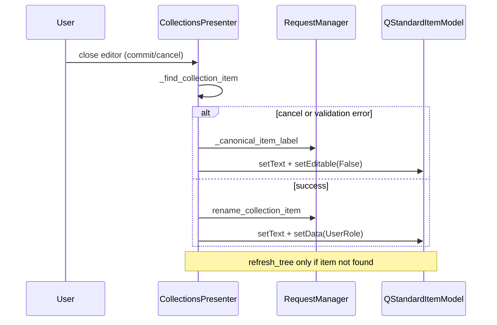

# PYPOST-347: Incremental tree updates on collection rename

## Research

- PYPOST-334: `remove_item_from_tree` removes one node without `refresh_tree`.
- PYPOST-47: `refresh_tree` rebuilds the full `QStandardItemModel` from
  `RequestManager.get_collections()`.
- Rename already mutates in-memory models via `RequestManager.rename_collection_item`; the UI
  only needs label and `UserRole` sync for the edited row.

## Implementation Plan

1. Add `_canonical_item_label` — resolve display text from `RequestManager` for a given id.
2. Add `_sync_rename_tree_item` — set label, `UserRole` (requests), and `setEditable(False)`.
3. Add `_finish_rename_tree_update` — locate item, sync in place, or fall back to
   `refresh_tree` + `restore_tree_state` when the item is missing.
4. Replace all rename-path `refresh_tree` calls in `_on_editor_closed` with
   `_finish_rename_tree_update`.
5. Extend presenter tests; update `FakeRequestManager.rename_collection_item` to mutate names.

## Architecture

| Component | Change |
|-----------|--------|
| `CollectionsPresenter` | Incremental rename sync helpers; `_on_editor_closed` uses them |
| `RequestManager` | Unchanged — already owns rename persistence |
| Tests | Assert `refresh_tree` not called on happy/cancel paths |

## Q&A

- **Q:** Why keep `refresh_tree` fallback? **A:** Defensive path when the model and manager are
  out of sync; same pattern as delete (`remove_item_from_tree` fallback).
