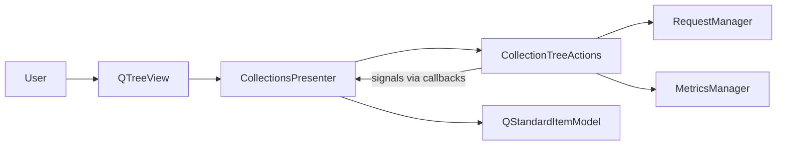

# PYPOST-349: Extract collection-tree context-menu actions

## Research

- `CollectionsPresenter` owned context menu, rename editor callbacks, and delete handling
  in one ~450-line module.
- PYPOST-36 follow-up explicitly requested a focused component/service.
- Presenter tests patch `QMenu` / `QMessageBox` at import site; paths must follow the
  extracted module.

## Implementation Plan

1. Add `CollectionTreeActions` in `pypost/ui/presenters/collection_tree_actions.py`.
2. Move context menu, rename flow, and delete flow from presenter into the new class.
3. Inject tree callbacks (`find_item`, `remove_item`, `refresh_tree`, `restore_tree_state`)
   and signal emitters from `CollectionsPresenter.__init__`.
4. Keep thin delegation methods on presenter for test compatibility.
5. Update test mock paths to `collection_tree_actions`.

## Architecture

| Component | Responsibility |
|-----------|----------------|
| `CollectionsPresenter` | Tree model, load/refresh, click-to-open, expand state |
| `CollectionTreeActions` | Context menu, rename editor lifecycle, delete flow |
| `RequestManager` | Rename/delete persistence (unchanged) |

### Callback injection

`CollectionTreeActions` receives callables for tree mutations and Qt signals so it stays
testable and does not subclass `QObject`.

## Q&A

- Q: Why callbacks instead of signals on `CollectionTreeActions`?
  A: Keeps the helper a plain class; presenter already owns `QObject` signals.
- Q: Why keep `_handle_delete` on presenter?
  A: Tests call it directly; it delegates to `CollectionTreeActions.handle_delete`.
