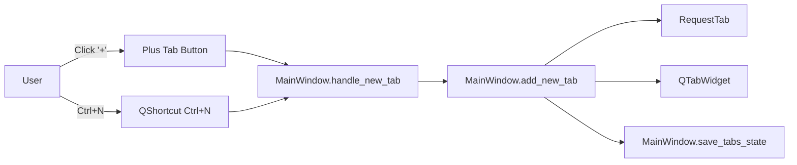

# PYPOST-35: Add New-Tab Plus Button Next to Tabs

## Research

### External research (Qt official docs)

1. `QTabWidget::setCornerWidget(...)` allows placing an extra widget in tab-frame corners.
   This is suitable for a persistent action button near tabs.
   Source: https://doc.qt.io/qt-6/qtabwidget.html#setCornerWidget
2. `QToolButton` is intended for compact toolbar-like actions and icon/text actions.
   Source: https://doc.qt.io/qt-6/qtoolbutton.html
3. `QTabBar::setTabButton(...)` can inject widgets per tab side, but it is tab-specific and
   less suitable for one global "new tab" button after all tabs.
   Source: https://doc.qt.io/qt-6/qtabbar.html#setTabButton
4. Existing shortcut flow should remain centralized via `QShortcut` and `QKeySequence`.
   Sources:
   - https://doc.qt.io/qt-6/qshortcut.html
   - https://doc.qt.io/qt-6/qkeysequence.html

### Current codebase findings

1. Tab container is `self.tabs = QTabWidget()` in `pypost/ui/main_window.py`.
2. New tab behavior is centralized:
   - `Ctrl+N` -> `_setup_shortcuts()` -> `handle_new_tab()`
   - `handle_new_tab()` -> `add_new_tab()`
3. `add_new_tab()` constructs `RequestTab`, wires signals, sets title, and persists state.
4. Hotkeys UI lists `Ctrl+N` as new-tab shortcut in `pypost/ui/dialogs/hotkeys_dialog.py`.

## Implementation Plan

1. Keep current business flow unchanged by reusing `MainWindow.handle_new_tab()`.
2. Add one UI control (`+`) in the tab area as a corner widget of `QTabWidget`.
3. Wire `+` button click directly to `handle_new_tab()`, matching `Ctrl+N` behavior.
4. Keep `Ctrl+N` shortcut mapping unchanged.
5. Limit change surface to `MainWindow` tab-area setup; no request data model changes.

## Architecture

### Module Diagram

### Modules and Responsibilities

1. `MainWindow` (`pypost/ui/main_window.py`)
   - Owns tab container and global shortcuts.
   - Owns new-tab orchestration (`handle_new_tab`, `add_new_tab`).
   - Will own creation and placement of the `+` tab button.
2. Tab container (`QTabWidget` in `MainWindow`)
   - Displays tabs and handles close/select behavior.
   - Hosts corner widget for global tab action entry point.
3. New-tab trigger inputs
   - Keyboard path: `QShortcut("Ctrl+N")`.
   - Mouse path: new `+` button click.
   - Both converge to the same handler.
4. `RequestTab` (`main_window.py`)
   - Concrete content created by `add_new_tab()`.

### Dependencies

1. `MainWindow` depends on Qt widgets (`QTabWidget`, button widget) and Qt shortcuts.
2. New `+` control depends only on `MainWindow.handle_new_tab` public behavior.
3. Existing tabs state persistence remains in `MainWindow.save_tabs_state()`.

### Selected Patterns and Justification

1. Single-entry action handler pattern
   - Keep one source of truth for new-tab behavior: `handle_new_tab()`.
   - Ensures mouse and keyboard produce identical outcomes.
2. Signal-slot event pattern (Qt)
   - Button click and shortcut activation are both event sources routed via slots.
3. Contained UI extension
   - Add button as tab-area extension, avoiding tab business-flow refactoring.

### Main Interfaces / APIs

1. `MainWindow.handle_new_tab()`
   - Input: none (UI event).
   - Output: calls `add_new_tab()` once.
2. `MainWindow.add_new_tab(request_data: RequestData = None, save_state: bool = True)`
   - Input: optional request seed.
   - Output: creates a new tab and optionally persists open tabs state.
3. `QShortcut("Ctrl+N").activated -> MainWindow.handle_new_tab`
4. `PlusButton.clicked -> MainWindow.handle_new_tab`

### Interaction Scheme

1. User clicks `+` in tab area (right of last tab).
2. UI emits click signal to `MainWindow.handle_new_tab()`.
3. Handler calls `add_new_tab()` (same as `Ctrl+N` path).
4. New `RequestTab` is added, selected, and state is saved.

## Q&A

- Q: Why not implement a second new-tab code path for the `+` button?
  - A: Reusing `handle_new_tab()` guarantees behavior parity with `Ctrl+N`.
- Q: Why prefer a tab-area corner widget over per-tab button injection?
  - A: Requirement is one global button right of tab list, not per-tab controls.
- Q: Does this architecture change request/save/send flows?
  - A: No. Changes are isolated to tab creation entry point UI.
