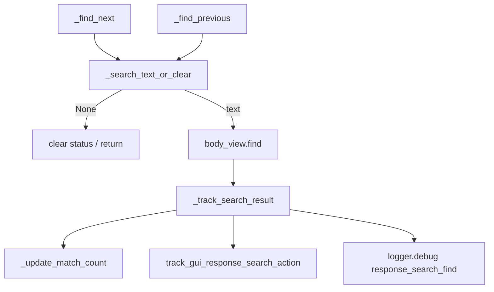

# PYPOST-354: Architecture — shared search navigation helper

## Research

### Duplication

`_find_next` and `_find_previous` each:

1. Read `search_input.text()`; if empty, clear status and return.
2. Call `body_view.find()` with forward or backward flags.
3. Call `_update_match_count()`.
4. Emit `track_gui_response_search_action(source=..., has_matches=...)`.
5. Log `response_search_find source=%s matches=%d`.

Steps 1 and 3–5 are identical aside from find direction.

### Out of scope for helper

`_on_search_text_changed` uses `source="typed"` and logs `response_search_typed` — different
contract; left as-is.

## Implementation Plan

1. Add `_search_text_or_clear() -> str | None` — empty-query guard shared by navigation methods.
2. Add `_track_search_result(source: str)` — update counter, metrics, DEBUG log.
3. Slim `_find_next` / `_find_previous` to: guard → find → track.
4. Document helpers in `doc/dev/response_search.md`.

## Architecture

### Module: `ResponseView` (`pypost/ui/widgets/response_view.py`)

**Responsibility:** Unchanged — display body and in-document search.

**Changes:** Two private helpers; public behaviour and signal wiring unchanged.

## Q&A

- **Q:** Why not fold typed search into the helper? **A:** Typed search uses a different log line
  and always moves to document start first; mixing would blur responsibilities.
- **Q:** Name `_track_search_result` vs `_track_search_find_result`? **A:** Matches PYPOST-37 tech
  debt suggestion.
