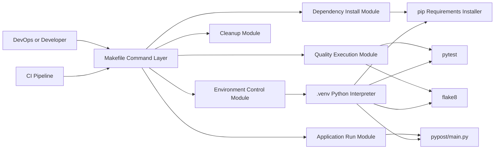

# PYPOST-36: Architecture for Reliable Python Automation in CI

## Research

### External research

1. Python `venv` docs define virtual environments as isolated Python runtimes and document
   direct invocation through the environment interpreter.
   Source: https://docs.python.org/3/library/venv.html
2. Python tutorial documents `.venv` as a common virtual environment directory location.
   Source: https://docs.python.org/3/tutorial/venv.html
3. GNU Make documentation confirms `.PHONY` usage for command-like targets to avoid file name
   conflicts and force explicit execution.
   Source: https://www.gnu.org/software/make/manual/html_node/Phony-Targets.html
4. pip user guide documents `python -m pip install -r requirements.txt` as the standard
   requirements-based installation flow.
   Source: https://pip.pypa.io/en/stable/user_guide/
5. pytest good practices recommend isolated environments and dependency installation through pip
   for reproducible test behavior.
   Source: https://docs.pytest.org/en/stable/explanation/goodpractices.html

### Current codebase findings

1. Project automation is centralized in `Makefile` with targets: `venv`, `venv-test`, `install`,
   `run`, `test`, `lint`, and `clean`.
2. Runtime code is launched from `pypost/main.py`, and quality checks target `tests/` and
   `pypost/`.
3. Existing reliability risk is split execution context, where test and lint may use either venv
   or global tools.
4. Step 1 requires CI reliability as the primary business goal and records `.venv` as the
   environment convention.

## Implementation Plan

1. Define one canonical execution boundary for all automation commands: project virtual
   environment.
2. Align command dependencies so environment setup and dependency installation happen before
   runtime and quality-check commands.
3. Remove split-context behavior in command execution paths and require one deterministic tool
   chain for CI and local usage.
4. Keep user-facing make target names unchanged per Step 1 constraints.
5. Preserve functional application behavior; scope is automation reliability only.

## Architecture

### Module Diagram

### Modules and Responsibilities

1. Environment Control Module
   - Owns virtual environment lifecycle and readiness checks.
   - Establishes `.venv` as the single project environment location.
2. Dependency Install Module
   - Installs project dependencies required for execution and validation.
   - Provides deterministic dependency state for CI and local runs.
3. Quality Execution Module
   - Executes test and lint quality gates as CI reliability controls.
   - Uses one tool context and one interpreter boundary.
4. Application Run Module
   - Starts the application in the same environment boundary used by CI checks.
5. Cleanup Module
   - Removes generated runtime and cache artifacts to reset local workspace state.

### Dependencies Between Modules

1. Dependency Install Module depends on Environment Control Module.
2. Quality Execution Module depends on Environment Control Module and Dependency Install Module.
3. Application Run Module depends on Environment Control Module and Dependency Install Module.
4. Cleanup Module is independent and can be invoked explicitly when reset is needed.

### Selected Architectural Patterns and Justification

1. Command-Orchestrator pattern (Makefile as coordinator)
   - Centralizes operational entry points used by both CI and local users.
2. Single Runtime Boundary pattern
   - Forces all quality and runtime commands through the same virtual environment to eliminate
     split-context failures.
3. Fail-Fast validation pattern
   - Stops execution when prerequisites are missing, reducing false-positive pipeline states.

### Main Interfaces Between Modules

1. `venv` interface
   - Purpose: prepare and validate project environment in `.venv`.
   - Consumer modules: dependency install, quality execution, application run.
2. `install` interface
   - Purpose: install project dependencies from requirements definitions.
   - Consumer modules: quality execution, application run.
3. `test` interface
   - Purpose: run project test suite and return CI-consumable exit status.
   - Consumer: CI pipeline and local pre-commit checks.
4. `lint` interface
   - Purpose: run static style and quality checks and return CI-consumable exit status.
   - Consumer: CI pipeline and local pre-commit checks.
5. `run` interface
   - Purpose: run the application with the same interpreter context as automation checks.
   - Consumer: local developer workflow.
6. `clean` interface
   - Purpose: remove environment and cache artifacts.
   - Consumer: local recovery and troubleshooting workflows.

### Interaction Scheme

1. Actor invokes `make <target>` from local shell or CI job.
2. Makefile resolves module dependencies for the target.
3. Environment Control confirms `.venv` availability.
4. Dependency Install ensures required packages are present.
5. Target-specific module executes (`test`, `lint`, or `run`) within one runtime boundary.
6. Exit code is returned to actor, where CI interprets pass or fail deterministically.

## Q&A

- Q: Why keep make target names unchanged?
  A: Step 1 constraints require interface stability for existing user and CI workflows.
- Q: Why enforce one environment boundary?
  A: CI reliability depends on removing inconsistent tool resolution between global and project
  environments.
- Q: Why include `.venv` at architecture level?
  A: Step 1 requirements define it as the project environment convention for consistent
  operations.
