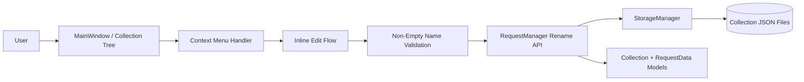

# PYPOST-36: Add Rename Action to Context Menu

## Research

### Project Baseline

- UI stack is PySide6 (`requirements.txt`).
- Tree UI is implemented in `pypost/ui/main_window.py` with `QTreeView` and
  `QStandardItemModel`.
- Existing collection item context menu in `MainWindow` currently supports only `Delete`.
- Business operations for collection/request mutations are centralized in
  `pypost/core/request_manager.py`.
- Persistence is handled by `pypost/core/storage.py` using collection JSON files.

### External References

- Qt docs: `QAbstractItemView` edit triggers and item editing lifecycle.
  https://doc.qt.io/qt-6/qabstractitemview.html
- Qt docs: `QTreeView` API including edit entry points.
  https://doc.qt.io/qt-6/qtreeview.html
- Qt docs: `QStandardItem` editable behavior and item flags.
  https://doc.qt.io/qt-6/qstandarditem.html

## Implementation Plan

1. Extend collection item context menu composition in `MainWindow` with `Rename`.
2. Keep item-type resolution unified for all tree entities in scope.
3. Trigger inline editing for the selected tree index through `QTreeView` APIs.
4. Validate rename result: reject empty names before persisting.
5. Delegate actual rename persistence to `RequestManager`.
6. Reload collections and restore tree/tabs state after successful rename.
7. Keep behavior identical across collection and request items.

## Architecture

### System Module Diagram

### Modules and Responsibilities

- `MainWindow` (presentation):
  handles context menu invocation, starts inline rename, displays validation feedback.
- `Context Menu Handler` (presentation helper in `MainWindow`):
  maps selected tree item to available actions (`Rename`, existing `Delete`).
- `Inline Edit Flow` (presentation interaction):
  enters edit mode on the selected tree node and captures user-submitted name.
- `RequestManager` (application/business layer):
  executes rename for supported item types and coordinates persistence.
- `StorageManager` (infrastructure layer):
  stores updated collection/request names in file storage.
- Domain models (`Collection`, `RequestData`):
  carry renamed business entities.

### Dependencies Between Modules

- `MainWindow` depends on Qt widgets and `RequestManager`.
- `RequestManager` depends on `StorageManager`.
- `StorageManager` depends on filesystem JSON storage.

Dependency direction remains:
`UI -> Application -> Infrastructure`.

### Selected Architectural Patterns

- Layered architecture:
  UI handles interactions; `RequestManager` holds business rules; `StorageManager` handles IO.
- Event-driven UI controller:
  context menu actions route to specific handlers in `MainWindow`.
- Validation gate before mutation:
  empty-name rejection happens before calling business rename operation.

Why this fits current Python/PySide6 project:
- Reuses existing `MainWindow` and manager boundaries without introducing new subsystem complexity.
- Keeps business mutations out of UI event code.
- Preserves consistency with recent delete-flow architecture.

### Module Interaction Scheme

1. User right-clicks any tree item and selects `Rename`.
2. UI starts inline editor on the selected item.
3. User submits edited name.
4. UI validates non-empty name.
5. UI calls `RequestManager` rename API with `(item_id, item_type, new_name)`.
6. Manager updates model and persists through `StorageManager`.
7. UI reloads collections and restores tree/tabs state.

### Main Interfaces / APIs

Presentation (`MainWindow`):
- `show_collection_item_context_menu(pos) -> None`
- `start_collection_item_rename(index) -> None`
- `handle_collection_item_rename(item_id: str, item_type: str, new_name: str) -> None`
- `validate_collection_item_name(name: str) -> bool`

Application (`RequestManager`):
- `rename_collection(collection_id: str, new_name: str) -> bool`
- `rename_request(request_id: str, new_name: str) -> bool`
- `rename_collection_item(item_id: str, item_type: str, new_name: str) -> bool`

Infrastructure (`StorageManager`):
- `save_collection(collection: Collection) -> None`

Contract expectations:
- `new_name` must be non-empty.
- Duplicate names under same parent are allowed.
- Rename APIs return `True` on success, `False` if target item is not found.
- Unexpected runtime/storage errors are surfaced to UI for user-visible feedback.

## Q&A

- Q: Why keep rename logic in `RequestManager`?
  A: To keep UI thin and centralize business mutations and persistence flow.
- Q: Why inline editing in UI instead of a dialog?
  A: Inline rename is an explicit requirement for faster, low-friction interaction.
- Q: Why allow duplicates?
  A: Requirement explicitly allows duplicate names under one parent.
