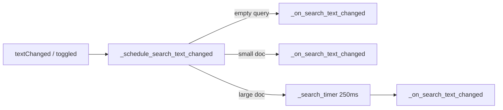

# PYPOST-363: Architecture — debounced search on large responses

## Research

### Current behaviour

- `search_input.textChanged` and `search_case_cb.toggled` call `_on_search_text_changed` directly.
- Each invocation moves to document start, finds first match, and runs `_count_matches()` (full scan
  on small docs; capped scan on large docs per PYPOST-364).

### Existing debounce patterns

- `ValidationController` and `FoldController` use `QTimer` single-shot with `_DEBOUNCE_MS = 200`.
- Timer owned by parent widget; `start()` restarts pending timeout.

## Implementation Plan

1. Add `SEARCH_DEBOUNCE_MS = 250` next to existing search constants.
2. Add `_search_timer: QTimer` in `init_ui`, timeout → `_on_search_text_changed`.
3. Replace direct signal connections with `_schedule_search_text_changed`:
   - Empty query → stop timer, call `_on_search_text_changed` immediately.
   - Large document → `timer.start()` (restart debounce).
   - Small document → stop timer, call `_on_search_text_changed` immediately.
4. Stop timer in `clear_body()` and `display_response()`.
5. Add tests: immediate small-doc search, debounced large-doc search, immediate clear on large doc.
6. Update `doc/dev/response_search.md`.

## Architecture

### Module: `ResponseView` (`pypost/ui/widgets/response_view.py`)

**Responsibility:** Display response body and in-body search.

**Changes:** Scheduling wrapper only; `_on_search_text_changed` body unchanged. Navigation
(Next/Previous/Enter) unchanged.

## Q&A

- **Q:** Why debounce only large docs? **A:** Small responses are fast enough; debouncing there
  would add perceived lag to the common case.
- **Q:** Why 250 ms? **A:** Midpoint of 200–300 ms requirement; matches nearby editor debounce
  magnitude (200 ms).
