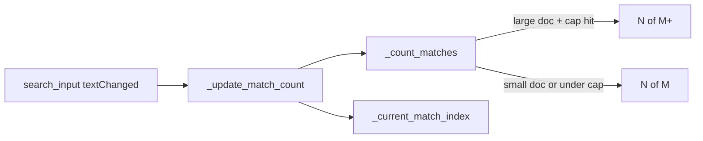

# PYPOST-364: Capped match count for large response search

## Research

### Current behaviour (`response_view.py`)

- `_count_matches()` iterates `QTextDocument.find()` from start until no more matches.
- `_current_match_index()` scans from start until the cursor position (already bounded; stops at
  current match).
- `_update_match_count()` combines both for labels like "2 of 5" or "No matches".
- `_current_match_index()` already caps iteration at 10_000 as a safety limit.

### Qt search API

- `QTextDocument.find()` is the same API used for navigation; no built-in match count.
- Document size is available via `len(body_view.toPlainText())` on the read-only body view.

## Implementation Plan

1. Add constants: `LARGE_DOC_CHAR_THRESHOLD = 100 * 1024`, `MATCH_COUNT_CAP = 1000`.
2. Add `_is_large_document()` helper based on plain-text character count.
3. Change `_count_matches()` to return `(count, capped: bool)`:
   - Small documents: scan entire document (unchanged).
   - Large documents: stop after `MATCH_COUNT_CAP` matches; set `capped=True` if another match
     exists beyond the cap.
4. Update `_update_match_count()` label formatting:
   - Capped: `"N of M+"` when current index known, else `"M+ match(es)"`.
   - Exact: keep existing strings.
5. Add tests with synthetic bodies above 100KB for capped and below-cap exact paths.
6. Update `doc/dev/response_search.md`.

## Architecture

### Module: `ResponseView` (`pypost/ui/widgets/response_view.py`)

**Responsibility:** Display response body and in-body search.

**Changes:** Capped counting logic isolated in `_count_matches()` and label formatting in
`_update_match_count()`. No changes to metrics, shortcuts, or navigation methods.

## Q&A

- **Q:** Why 1000 as cap? **A:** Balances early exit on very match-heavy documents with a readable
  upper bound; aligns with existing 10_000 safety cap magnitude.
- **Q:** Debounce? **A:** Out of scope (PYPOST-363).
