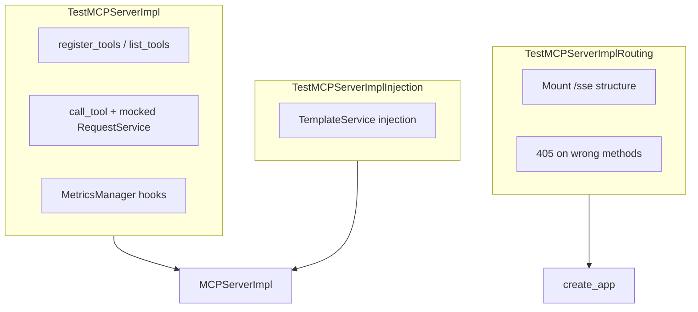

# PYPOST-367: Architecture — MCP Server Unit Tests

## Research

- Existing coverage: `tests/test_mcp_server_impl.py` (PYPOST-139/142) mocks `RequestService`
  and uses `asyncio.run` for async handlers.
- Routing: `MCPServerImpl.create_app()` nests a Starlette sub-app under `Mount("/sse")` with
  `GET /` (SSE) and `Mount("/messages")` (client POST). Live GET `/sse` blocks in TestClient.
- Project rule: every test needs explicit `pytest.mark.timeout` (`.cursor/lsr/do-testing.md`).

## Test Layout

## Modules Under Test

| Component | File | Test approach |
| --- | --- | --- |
| Tool registration & execution | `pypost/core/mcp_server_impl.py` | `MagicMock` for `request_service`, `asyncio.run` |
| HTTP routing | `create_app()` | Inspect `Mount`/`Route` tree; `TestClient` for 405/404 only |
| Template injection | `__init__(template_service=...)` | Assert `parse` called during `list_tools` |

## Out of Scope

- Live SSE session or MCP client round-trip (PYPOST-368).
- `MCPServerManager` thread/uvicorn lifecycle.
- MetricsManager observability MCP server routes.

## Files Changed

| File | Change |
| --- | --- |
| `tests/test_mcp_server_impl.py` | Add `TestMCPServerImplRouting` |
| `doc/dev/testing.md` | Document focused pytest command |
