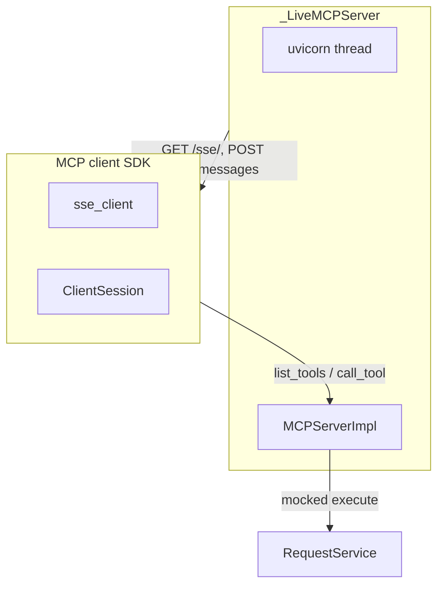

# PYPOST-368: Architecture — MCP Server Integration Tests

## Research

- Unit coverage: `tests/test_mcp_server_impl.py` (PYPOST-367) mocks `RequestService` and avoids
  live SSE.
- Client reference: `pypost/core/mcp_client_service.py` wraps `sse_client` + `ClientSession` but
  uses `asyncio.run`, which does not reliably drive the anyio task group inside `sse_client`.
- Production startup: `MCPServerManager` spawns a daemon thread running `uvicorn.Server.serve()`
  on `MCPServerImpl.create_app()`.

## Test Layout

## Modules Under Test

| Component | File | Test approach |
| --- | --- | --- |
| MCP server app | `pypost/core/mcp_server_impl.py` | uvicorn on ephemeral port |
| Manager lifecycle | `pypost/core/mcp_server.py` | `MCPServerManager.start_server` / `stop_server` |
| MCP client | `mcp.client.sse`, `mcp.client.session` | `anyio.run` + async helpers |

## Harness Details

- `_free_port()` binds `127.0.0.1:0` for collision-free ports.
- `_wait_for_port()` polls TCP connect until uvicorn listens.
- `live_mcp_server` context manager starts/stops `_LiveMCPServer`.
- SSE URL uses trailing slash (`/sse/`) to avoid redirect races during handshake.
- `RequestService.execute` mocked where outbound HTTP is out of scope.

## Out of Scope

- Prometheus metrics server MCP resources.
- Real outbound HTTP to external hosts.
- Fixing `MCPClientService` asyncio/anyio interop (follow-up debt).

## Files Changed

| File | Change |
| --- | --- |
| `tests/test_mcp_server_integration.py` | New integration test module |
| `doc/dev/testing.md` | Document focused pytest command |
