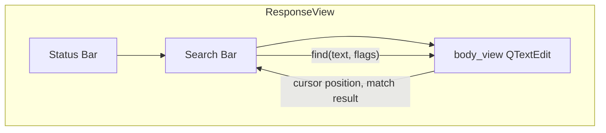

# PYPOST-37: Search in Response Window

## Research

### Qt/PySide6 Text Search API

- **QTextEdit.find(exp, options)** — high-level search. Returns `bool` (success). Uses current
  cursor position as start; after successful find, cursor moves to match and view scrolls.
- **QTextDocument.FindFlag** — options: `FindCaseSensitively`, `FindBackward`, `FindWholeWords`.
- Plain text search: pass `QString` to `find()`, not `QRegularExpression`.
- For "find next": call `find()` again — it continues from current cursor. For "find previous":
  use `FindBackward` flag.
- **Match count**: `QTextDocument.find()` does not return count. To get total matches, iterate
  from document start with `find()` in a loop until no more matches.

### Hotkey Availability

- **Ctrl+F** is not used in PyPost (checked [main_window.py](pypost/ui/main_window.py),
  [request_editor.py](pypost/ui/widgets/request_editor.py)). Safe to use for "focus search".

## Implementation Plan

1. Add search bar UI to `ResponseView` (between status bar and body view, or above body).
2. Implement search logic using `QTextEdit.find()` with `QTextDocument.FindFlag`.
3. Add Next/Previous buttons and optional case-sensitivity checkbox.
4. Add match counter (e.g. "2 of 5") — requires pre-scan to count matches.
5. Register Ctrl+F shortcut to focus search input when `ResponseView` is visible.

## Architecture

### Component Diagram

### Module: ResponseView (`pypost/ui/widgets/response_view.py`)

**Responsibility:** Display HTTP response body and provide text search within it.

**Changes:**

1. **New UI elements (Search Bar)**
   - `QLineEdit` — search input
   - `QPushButton` "Previous" — find previous match
   - `QPushButton` "Next" — find next match
   - `QCheckBox` "Match case" (optional) — case sensitivity
   - `QLabel` — match counter or "No matches" message

2. **Layout**
   - Insert search bar between status bar and body view (or as collapsible bar above body).
   - Search bar: horizontal layout with input, buttons, checkbox, label.

3. **New methods**
   - `_find_next()` — find next occurrence from current cursor. Uses
     `body_view.find(text, flags)`.
   - `_find_previous()` — find previous. Uses `FindBackward` flag.
   - `_update_match_count()` — count total matches and update label; optionally show
     "N of M" or "No matches".
   - `_on_search_text_changed()` — when user types, clear previous highlight and run first
     search (or update count only until user presses Next/Previous).

4. **Search logic**
   - Use `QTextDocument.FindFlag.FindCaseSensitively` when checkbox checked.
   - Use `QTextDocument.FindFlag.FindBackward` for previous.
   - For match count: iterate from document start with `find()` in loop, then restore cursor.

5. **Shortcut**
   - `QShortcut(QKeySequence("Ctrl+F"), self)` — set focus to search input. Context: when
     `ResponseView` or its children have focus.

6. **Clear on new response**
   - When `clear_body()` or `display_response()` is called, clear search input and reset
     match counter.

### Module Interaction

- **ResponseView** is self-contained. No changes to `MainWindow` or `RequestTab` required.
- Search bar is a child of `ResponseView`; all logic stays within the widget.
- `body_view` (QTextEdit) provides `find()`; search bar triggers it and updates UI.

### Interfaces

| Component | Interface | Description |
|-----------|-----------|-------------|
| Search input | `textChanged` | User types or clears search string |
| Previous button | `clicked` | Trigger `_find_previous()` |
| Next button | `clicked` | Trigger `_find_next()` |
| Case checkbox | `toggled` | Update search flags for next find |
| body_view | `find(exp, flags)` | Qt API for text search |

### Dependencies

- **PySide6.QtWidgets:** QLineEdit, QPushButton, QCheckBox, QHBoxLayout
- **PySide6.QtGui:** QTextCursor, QShortcut, QKeySequence
- **PySide6.QtCore:** Qt, Signal
- **QTextDocument.FindFlag** (from QtGui)

### Risks and Mitigations

| Risk | Mitigation |
|------|------------|
| Match count slow on large documents | Compute count only when search text changes; debounce or run in background |
| JsonHighlighter may affect search | `find()` works on plain text; highlighter does not affect document content |
| Search bar takes space | Use compact layout; consider optional collapse |

## Q&A

- **Q:** Where to place search bar? **A:** Between status bar and body view. Compact.
- **Q:** Highlight all matches? **A:** Out of scope per requirements. Only jump to match.
- **Q:** Match count performance? **A:** For large responses (e.g. 100KB+), count iteration
  may be slow. Consider lazy count or "N+ matches" cap for very large documents.
