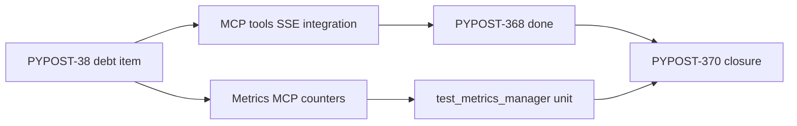

# PYPOST-370: Architecture — Scope Closure

## Existing Coverage Map

| Concern | Module | Level | Ticket |
| --- | --- | --- | --- |
| MCP tool `list_tools` / `call_tool` over SSE | `tests/test_mcp_server_integration.py` | Integration | PYPOST-368 |
| `MCPServerManager` lifecycle | `tests/test_mcp_server_integration.py` | Integration | PYPOST-368 |
| `MCPServerImpl` routing, schemas, metrics hooks | `tests/test_mcp_server_impl.py` | Unit | PYPOST-367 |
| Metrics `read_resource("metrics://all")` counters | `tests/test_metrics_manager.py` | Unit | PYPOST-79 |

## Closure Decision

PYPOST-370 does not add a new test harness. Documentation links the debt item to the modules
above and defers live metrics-server SSE and outbound HTTP stub coverage to follow-up tickets.

## Out of Scope (Follow-Up)

- `MetricsManager` uvicorn MCP SSE round-trip (separate metrics server process).
- Integration test with real outbound HTTP via local stub server.

## Files Changed

| File | Change |
| --- | --- |
| `doc/dev/testing.md` | MCP metrics coverage scope table |
| `ai-tasks/PYPOST-370/*` | Closure artifacts |
