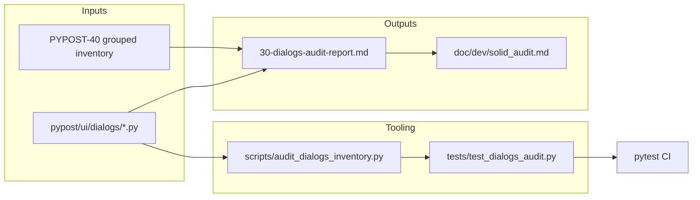

# PYPOST-374: Architecture

## Research

- PYPOST-40 audit report (`ai-tasks/PYPOST-40/30-audit-report.md`) — grouped `ui/dialogs/` at
  ~400 LOC; no per-dialog SOLID table.
- PYPOST-40 methodology (`ai-tasks/PYPOST-40/20-architecture.md`) — five-phase manual walkthrough
  with qualitative severity and finding IDs.
- PYPOST-376 / PYPOST-568 patterns — offline script + repo-stored report + dev docs section +
  optional regression test.
- Current tree (2026-06-11): seven dialog modules, 923 total LOC (SettingsDialog 423 LOC).

## Implementation Plan

1. Walk each `pypost/ui/dialogs/*.py` module; record LOC, callers, and SOLID notes.
2. Publish `30-dialogs-audit-report.md` with per-dialog tables and prioritized recommendations.
3. Implement `scripts/audit_dialogs_inventory.py` (LOC + module list).
4. Add `tests/test_dialogs_audit.py` — inventory matches disk; report mentions every module.
5. Update `doc/dev/solid_audit.md` and `doc/dev/testing.md`.

## Architecture

| Component | Responsibility |
| --- | --- |
| `30-dialogs-audit-report.md` | Per-dialog SOLID + maintainability findings |
| `audit_dialogs_inventory.py` | Reproduce module list and LOC |
| `test_dialogs_audit.py` | Fail CI if dialog added without audit coverage |

## Dialog caller map

| Dialog | Opened from |
| --- | --- |
| `AboutDialog` | `main_window.py` (Help menu) |
| `HotkeysDialog` | `main_window.py` (Help menu) |
| `SettingsDialog` | `main_window.py` (Settings action) |
| `EnvironmentDialog` | `env_presenter.py` |
| `McpActivityDialog` | `env_presenter.py` |
| `McpToolsOverviewDialog` | `env_presenter.py` |
| `SaveRequestDialog` | `request_save_orchestrator.py` |

## Classification criteria

Same qualitative scale as PYPOST-40:

| Severity | Criteria |
| --- | --- |
| **High** | Clear SRP/DIP violation blocking testability or safe extension |
| **Medium** | Maintainability risk (duplication, hardcoded config drift) |
| **Low** | Minor polish; acceptable for current scope |

## Q&A

| Question | Answer |
| --- | --- |
| Why a script if audit is manual? | Script guards inventory completeness when dialogs are added; LOC drift is measurable. |
| Why not cap SettingsDialog LOC in CI? | Out of scope; report recommends split; caps can follow in a refactor task. |
