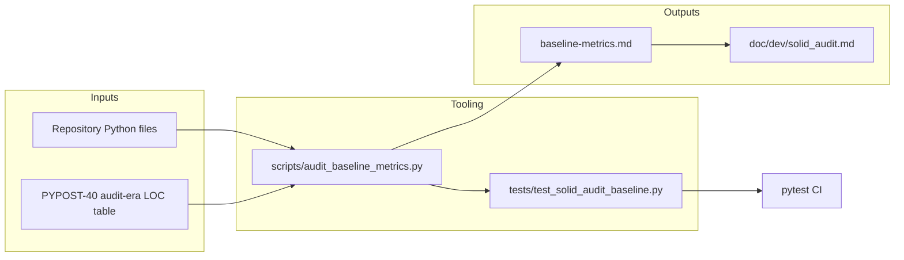

# PYPOST-376: Architecture

## Research

- PYPOST-40 audit report (`ai-tasks/PYPOST-40/30-audit-report.md`) — module inventory and
  finding IDs F1–F11; MainWindow 1040 LOC at audit time.
- PYPOST-43 presenter split — `MainWindow` now a composition root; presenters hold extracted
  logic.
- PYPOST-567 pattern — offline script + repo-stored inventory + dev docs section in
  `doc/dev/testing.md`.

## Implementation Plan

1. Define cap constants from 2026-06-11 measurements (~10% headroom).
2. Implement `scripts/audit_baseline_metrics.py`:
   - AST class LOC for `MainWindow`
   - File LOC for audit inventory modules
   - `--markdown`, `--json`, `--check` CLI modes
3. Add `tests/test_solid_audit_baseline.py` importing script module (same pattern as manual
   verification, no duplicate cap tables).
4. Generate `ai-tasks/PYPOST-376/baseline-metrics.md`.
5. Update `doc/dev/solid_audit.md` and `doc/dev/testing.md`.

## Architecture

| Component | Responsibility |
| --- | --- |
| `audit_baseline_metrics.py` | Measure LOC, compare to caps, export reports |
| `test_solid_audit_baseline.py` | Fail CI on cap violations |
| `baseline-metrics.md` | Human-readable snapshot attached to task |
| `doc/dev/solid_audit.md` | Maintainer guide for baselines and cap updates |

## Cap Policy

| Tier | Modules | Rationale |
| --- | --- | --- |
| P1 | `main_window.py`, presenters | Primary god-object regression surface |
| P2 | `request_service`, `metrics`, `template_service` | DIP / singleton audit findings |
| P2 | `request_manager`, `http_client`, `storage`, `worker`, `mcp_server_impl` | Core audit inventory |

Headroom: **10%** above measured baseline unless noted in snapshot.

## Q&A

| Question | Answer |
| --- | --- |
| Why AST for class LOC? | File LOC alone misses growth inside `MainWindow` while imports shrink. |
| Why not radon? | Out of scope (PYPOST-373); LOC caps satisfy this debt item. |
