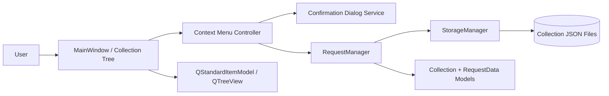

# PYPOST-38: Add Delete Action in Collection Item Context Menu

## Research

### Project Baseline

- UI stack is PySide6 (`requirements.txt`).
- Collection tree UI lives in `pypost/ui/main_window.py` (`QTreeView` + `QStandardItemModel`).
- Business data layer is `pypost/core/request_manager.py` (`Collection`, `RequestData` lifecycle).
- Persistence layer is `pypost/core/storage.py` (collection JSON files).
- There is currently no collection item context menu in `MainWindow`.
- Existing flow already uses confirmation dialogs for destructive/overwrite actions (`QMessageBox`).

### External References

- Qt `QTreeView` docs for tree interaction and extension points:
  https://doc.qt.io/qt-6/qtreeview.html
- Qt `QWidget` context menu policy and `customContextMenuRequested` signal:
  https://doc.qt.io/qt-6/qwidget.html#contextMenuPolicy-prop
- Qt `QMessageBox` docs for confirmation patterns:
  https://doc.qt.io/qt-6/qmessagebox.html

## Implementation Plan

1. Add a collection-tree context menu entry point in `MainWindow`.
2. Resolve clicked tree item into a domain target (`Collection` or `RequestData`).
3. Build menu actions dynamically; include `Delete` for supported collection item types.
4. On `Delete`, show confirmation dialog and stop if user cancels.
5. Delegate deletion to `RequestManager` as the business layer boundary.
6. Persist via `StorageManager`, reload tree model, and restore UI state.
7. Keep UI behavior consistent for all in-scope item types.

## Architecture

### System Module Diagram

### Modules and Responsibilities

- `MainWindow` (presentation):
  Owns `QTreeView`, maps UI item selection, opens context menu, triggers refresh.
- `Context Menu Controller` (presentation helper inside `MainWindow`):
  Creates actions by item type and routes action handlers.
- `Confirmation Dialog Service` (`QMessageBox` usage):
  Enforces explicit user confirmation before destructive operation.
- `RequestManager` (application/business layer):
  Provides delete operations for collection items and keeps request index consistent.
- `StorageManager` (infrastructure layer):
  Persists updated collection state to JSON storage.
- `Collection/RequestData` models (domain data):
  Business entities affected by delete operations.

### Dependencies Between Modules

- UI depends on `RequestManager` for business actions.
- `RequestManager` depends on `StorageManager` for persistence.
- `StorageManager` depends on filesystem JSON storage.
- UI depends on Qt widgets/dialogs (`QTreeView`, `QMenu`, `QMessageBox`) for interaction.

Dependency direction remains one-way:
`UI -> Application -> Infrastructure`.

### Selected Architectural Patterns

- Layered architecture:
  Keep event handling in UI, decision/rules in manager, persistence in storage.
- Controller-like UI action routing:
  `MainWindow` action handlers map user intent to business operations.
- Confirmation gateway for destructive action:
  Centralize delete confirmation so safety behavior is uniform.

Why this fits Python/PySide6 here:
- Minimal change to current class layout.
- Explicit method boundaries match readable, direct Python style.
- Avoids duplicating storage logic in UI code.

### Module Interaction Scheme

1. User right-clicks collection tree item.
2. UI resolves item type and opens context menu.
3. User selects `Delete`.
4. UI asks for confirmation.
5. If confirmed, UI calls `RequestManager.delete_*`.
6. `RequestManager` mutates in-memory entities and persists via `StorageManager`.
7. UI reloads tree model and restores expanded/selection state where possible.

### Main Interfaces / APIs

Presentation (`MainWindow`):
- `show_collection_item_context_menu(pos) -> None`
- `build_collection_item_actions(item_data) -> list[ActionSpec]`
- `confirm_delete(item_label: str) -> bool`
- `handle_delete_collection_item(item_data) -> None`

Application (`RequestManager`):
- `delete_request(request_id: str) -> bool`
- `delete_collection(collection_id: str) -> bool`
- `delete_collection_item(item_id: str, item_type: str) -> bool`

Infrastructure (`StorageManager`):
- `save_collection(collection: Collection) -> None`
- Optional extension if needed by implementation:
  `delete_collection(collection_name: str) -> None`

Contract expectations:
- Return `True` on successful deletion, `False` when target does not exist.
- Raise only unexpected runtime errors (IO, serialization), handled in UI with error message.

## Q&A

- Q: Why place delete business logic in `RequestManager` instead of `MainWindow`?
  A: To keep UI thin and avoid persistence/business rule duplication.
- Q: Why include confirmation at UI boundary?
  A: Confirmation is user-interaction policy and must occur before state mutation.
- Q: Will this support all collection item types in scope?
  A: Yes, action mapping is item-type based and designed to cover all scoped types.
