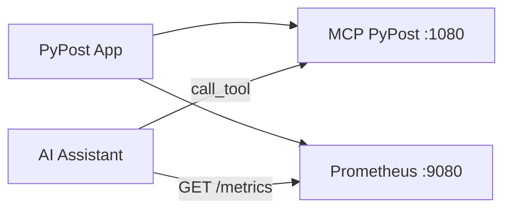

# PYPOST-38: Testing Rules via MCP and Prometheus

## Overview

Rules for the AI assistant to test PyPost via the embedded MCP server and Prometheus
metrics. No new code — documentation only.

## Architecture

### Flow

### Components

| Component | Port | Description |
|-----------|------|-------------|
| MCP PyPost | 1080 | SSE at `http://localhost:1080/sse`. Exposes HTTP requests as tools. |
| MetricsManager | 9080 | Prometheus at `http://localhost:9080/metrics/`. MCP resource `metrics://all`. |

### Artifact: do-testing.md

**Location:** [.cursor/lsr/do-testing.md](.cursor/lsr/do-testing.md)

**Content:**

- Prerequisites: PyPost running, MCP enabled in environment, Cursor connected.
- Testing via MCP: connection URL, tool invocation, response verification.
- Verification via Prometheus: endpoint, key metrics, expected increments.
- Step-by-step procedure for the AI.

**References:** [doc/mcp_integration.md](doc/mcp_integration.md), [pypost/core/metrics.py](pypost/core/metrics.py).

## Q&A

- **Q:** Why not a separate MCP server for pytest? **A:** Use the embedded MCP for
  testing the application itself. Rules document how to do it.
