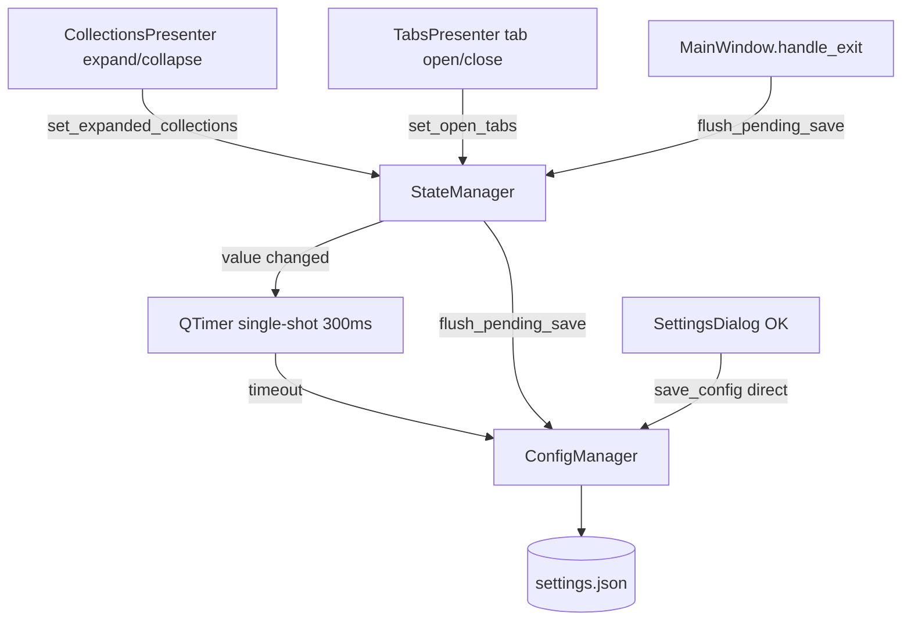

# PYPOST-386: Debounced UI state persistence

## Research

UI session state (expanded collections, open tabs, last environment id) is stored in
`AppSettings` and written through `StateManager` → `ConfigManager.save_config()`. Each
`set_*` call currently invokes `save()` synchronously, rewriting the full settings JSON on
every expand/collapse or tab change.

The codebase already uses **single-shot `QTimer` debouncing** for editor workloads
(`FoldController`, `ValidationController`, `ResponseView` search). Environment storage uses
**save coalescing** in `EnvironmentStorageGateway` (latest snapshot wins while busy).

Settings dialog persistence is intentionally separate: `MainWindow.open_settings()` calls
`config_manager.save_config()` once on dialog accept — out of scope for debouncing.

Qt requires a `QObject` event loop for timers. Tests that use real `StateManager` must either
call `flush_pending_save()` or process the event loop until the debounce timer fires.

## Implementation Plan

1. Extend `StateManager` with a single-shot debounce timer (300 ms, aligned with other UI
   debounce intervals).
2. Route `set_expanded_collections`, `set_open_tabs`, and `set_last_environment_id` through
   `_schedule_save()` instead of immediate `save()` when values change.
3. Add `flush_pending_save()` to persist pending UI state immediately; call it from
   `MainWindow.handle_exit()` before `QApplication.quit()`.
4. Keep `save()` as the immediate-write API (used by flush and any future explicit callers).
5. Preserve no-op behavior when the new value equals the current in-memory value.
6. Add tests in `test_settings_persistence.py` for coalescing and flush semantics; extend
   shutdown test to assert flush on exit.
7. Document debounce behavior in `doc/dev/architecture.md` and `collection_tree_actions.md`.

## Architecture



| Component | Responsibility |
| --- | --- |
| `StateManager` | In-memory `AppSettings`; debounced disk writes for UI mutations |
| `ConfigManager` | Atomic JSON read/write of settings file |
| `MainWindow.handle_exit` | Flush pending UI state before quit |
| `MainWindow.open_settings` | Immediate save on explicit user confirm (unchanged) |

### Debounce policy

- **Debounce interval:** 300 ms (`_UI_STATE_SAVE_DEBOUNCE_MS`).
- **Coalescing:** Each new UI mutation while the timer is running updates in-memory settings
  and restarts the timer; only one disk write occurs after activity stops.
- **Durability:** `flush_pending_save()` writes immediately if a save is pending (normal exit
  path).
- **No-op:** Unchanged values do not schedule a save (existing behavior preserved).

### Interfaces

```python
class StateManager(QObject):
    def save(self) -> None: ...
    def flush_pending_save(self) -> None: ...
    def set_expanded_collections(self, ids: List[str]) -> None: ...
    def set_open_tabs(self, ids: List[str]) -> None: ...
    def set_last_environment_id(self, env_id: Optional[str]) -> None: ...
```

Optional `parent: QObject | None` for timer lifecycle; `MainWindow` passes `parent=self`.

## Q&A

- **Q:** Why not debounce Settings dialog saves? **A:** Explicit user confirm must persist
  immediately; requirements exclude Settings dialog from this change.
- **Q:** Why 300 ms? **A:** Matches responsiveness goals and sits between existing 200 ms editor
  debounces and human click cadence; coalesces bursts without noticeable delay on idle.
- **Q:** Environment selection writes? **A:** `EnvPresenter` writes via `config_manager` directly;
  out of scope per requirements. `set_last_environment_id` is debounced for consistency if used
  later.
- **Q:** Relation to PYPOST-392? **A:** PYPOST-386 delivers the coalesced-write outcome PYPOST-392
  anticipated.
