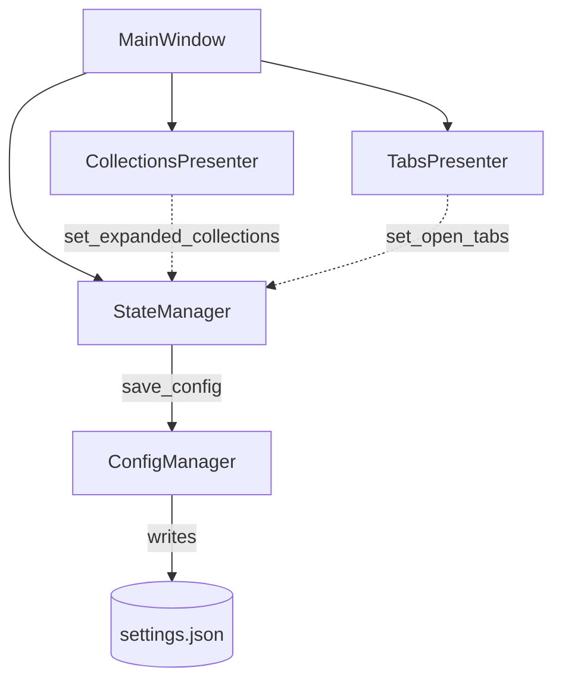

# PYPOST-386: Reduce redundant disk writes from frequent UI state changes

## Research

Research on debouncing UI state changes in desktop applications (specifically using PySide6/Qt)
reveals that immediate synchronous saving of UI state (like tree expansions or open tabs) is an
anti-pattern when users perform rapid sequence interactions. Each disk write involves blocking
I/O that can degrade responsiveness and cause UI stuttering or sluggishness.

### Key Findings
1. **Debouncing via QTimer**:
   The standard Qt pattern for delaying save actions is to use a single-shot `QTimer`. When a
   state-changing event occurs, the timer is started or restarted. The actual write operation
   is deferred until the timer fires after a pause in user activity.
2. **Coalescing Rapid Updates**:
   Restarting the `QTimer` on every modification naturally coalesces rapid sequential writes into
   a single disk operation once the user stops interacting (e.g., 300 ms debounce window).
3. **Durability & Flush-on-Exit**:
   To prevent data loss if the application exits while a write is still pending, any active timer
   must be synchronously flushed. Overriding exit hooks (such as `closeEvent` or connecting to
   `QApplication.aboutToQuit`) and calling a synchronous flush ensures full state durability.

---

## Implementation Plan

1. **Subclass StateManager as QObject**:
   Modify `StateManager` in `pypost/core/state_manager.py` to subclass `QObject` so it can natively
   manage Qt timers.
2. **Introduce Debounce Timer**:
   - Add a private single-shot `QTimer` to `StateManager` with a 300 ms interval.
   - Maintain a boolean flag `_save_pending` to track if unsaved UI changes exist.
3. **Update Persistence Methods**:
   Refactor `set_expanded_collections`, `set_open_tabs`, and `set_last_environment_id` to update
   in-memory `AppSettings` immediately and schedule a debounced save instead of calling `save()`
   synchronously.
4. **Implement Flush Method**:
   Add a public `flush_pending_save()` method that instantly writes settings to disk if a save is
   pending, resetting the timer and pending flag.
5. **Integrate into MainWindow Exit**:
   In `MainWindow.handle_exit()` (`pypost/ui/main_window.py`), call `state_manager.flush_pending_save()`
   prior to quitting the application.
6. **Extend Test Suite**:
   Add unit tests in `tests/test_settings_persistence.py` to verify that rapid mutations are
   coalesced and that `flush_pending_save()` successfully saves pending states. Update shutdown
   tests in `tests/test_main_window_shutdown.py` to assert flush is called during exit.

---

## Architecture

### Module Diagram



### Module Descriptions and Responsibilities

- **MainWindow** (`pypost/ui/main_window.py`): Main window controller; manages startup, shutdown,
  and lifecycle; triggers flushing of state on exit.
- **StateManager** (`pypost/core/state_manager.py`): Coordinates UI session state (expanded
  collections, open tabs, active environment); manages the debounce timer and in-memory AppSettings.
- **ConfigManager** (`pypost/core/config_manager.py`): Handles low-level loading and immediate
  synchronous writing of settings to `settings.json`.
- **CollectionsPresenter** (`pypost/ui/presenters/collections_presenter.py`): Controls the
  sidebar's tree view; notifies StateManager when nodes are expanded or collapsed.
- **TabsPresenter** (`pypost/ui/presenters/tabs_presenter.py`): Manages opened request tabs;
  notifies StateManager of tab-state changes.

### Module Interaction Scheme

1. **Bursty UI State Changes (Coalescing)**:
   - User rapidly clicks several collection expand/collapse arrows in the sidebar.
   - `CollectionsPresenter` receives signals and calls `StateManager.set_expanded_collections()`.
   - `StateManager` updates in-memory `AppSettings`, sets `_save_pending = True`, and starts or
     restarts the 300 ms `QTimer`.
   - Subsequent clicks within 300 ms restart the timer, postponing the actual write.
   - After 300 ms of inactivity, the timer fires, calling `save_config` to write the final state
     once.

2. **Application Exit (Durability)**:
   - User closes the app or selects "Quit".
   - `MainWindow.handle_exit()` is invoked.
   - `MainWindow` calls `StateManager.flush_pending_save()`.
   - If `_save_pending` is `True`, `StateManager` immediately stops the timer and saves the
     settings synchronously via `ConfigManager.save_config()`, ensuring zero state loss.

### Architectural Patterns

- **Debounce / Coalesced Writes Pattern**: Converting high-frequency, bursty UI mutations into a
  single deferred write operation after a period of inactivity. This dramatically lowers disk I/O
  overhead.
- **Flush-on-Shutdown Pattern**: Force-flushing all unwritten memory state to disk before system
  exit to maintain perfect durability.

### Main Interfaces / APIs

#### `StateManager` API

```python
class StateManager(QObject):
    def __init__(self, config_manager: ConfigManager, parent: QObject | None = None) -> None:
        """Initialize StateManager and configure the 300 ms debounce timer."""
        ...

    def save(self) -> None:
        """Persist the current state to disk immediately, stopping any active timer."""
        ...

    def flush_pending_save(self) -> None:
        """Write pending UI state immediately to disk if a save is currently scheduled."""
        ...

    def set_expanded_collections(self, ids: List[str]) -> None:
        """Update expanded collection ids. Schedules a debounced save if state changed."""
        ...

    def set_open_tabs(self, ids: List[str]) -> None:
        """Update open tab ids. Schedules a debounced save if state changed."""
        ...

    def set_last_environment_id(self, env_id: Optional[str]) -> None:
        """Update last environment id. Schedules a debounced save if state changed."""
        ...
```

---

## Q&A

- **Q**: Why choose 300 ms as the debounce interval?
  - **A**: 300 ms is standard in UI debouncing. It is short enough to feel instant (the user won't
    notice any lag when quitting after an interaction) and long enough to easily group rapid clicks.
- **Q**: What happens to explicit Settings saves?
  - **A**: Explicit saves initiated via the `SettingsDialog` call `ConfigManager.save_config()`
    directly and immediately bypass `StateManager`'s debouncing entirely, preserving the immediate
    and predictable saving of preferences.
- **Q**: How does the state manager handle environment selection changes?
  - **A**: If environment changes share the `StateManager` path, they are debounced exactly like
    tab and expansion changes.
