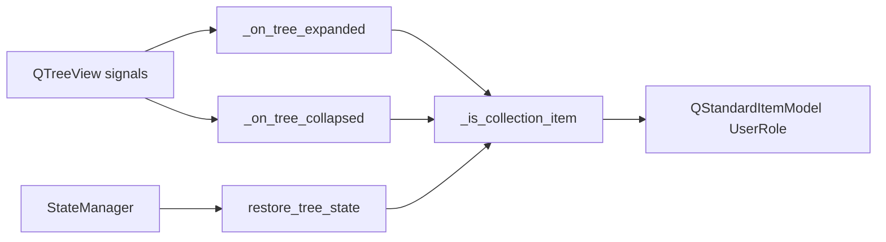

# PYPOST-387: Collection item type check helper

## Research

- Collection rows store collection id (`str`) in `Qt.UserRole`.
- Request rows store `RequestData` in `Qt.UserRole`.
- `_on_tree_expanded` / `_on_tree_collapsed` receive `QModelIndex` from `QTreeView` signals.
- `restore_tree_state` iterates root-level items and re-expands saved collection ids.

## Implementation Plan

1. Add `_is_collection_item(self, index) -> bool` on `CollectionsPresenter`:
   - Resolve item via `self._model.itemFromIndex(index)`.
   - Return `False` when item is missing.
   - Return `isinstance(item.data(Qt.UserRole), str)`.
2. Update `_on_tree_expanded` / `_on_tree_collapsed` to early-return when not a collection.
3. Update `restore_tree_state` to use `_is_collection_item(item.index())`.
4. Add unit tests for collection vs request indices.

## Architecture

| Component | Change |
|-----------|--------|
| `CollectionsPresenter` | New `_is_collection_item`; three call sites updated |
| `StateManager` | Unchanged |
| Tests | Two helper tests; existing expand/collapse/restore tests unchanged |

## Q&A

- **Q:** Why index-based helper vs data-based? **A:** Matches tech-debt recommendation and signal
  handlers; `restore_tree_state` uses `item.index()`.
