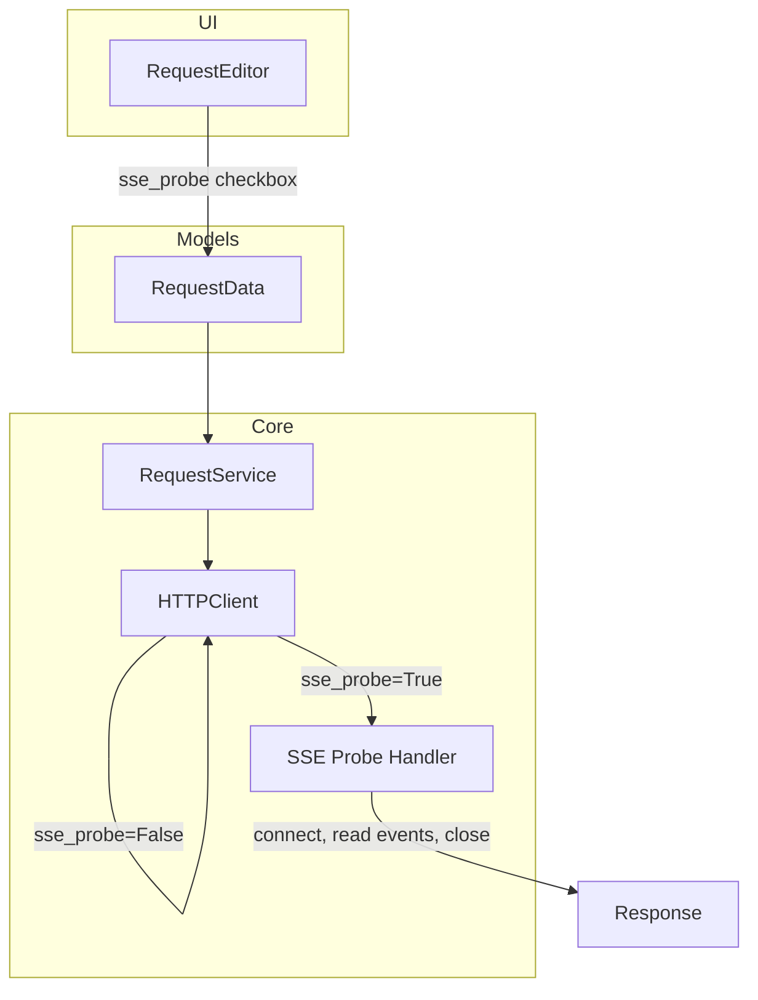
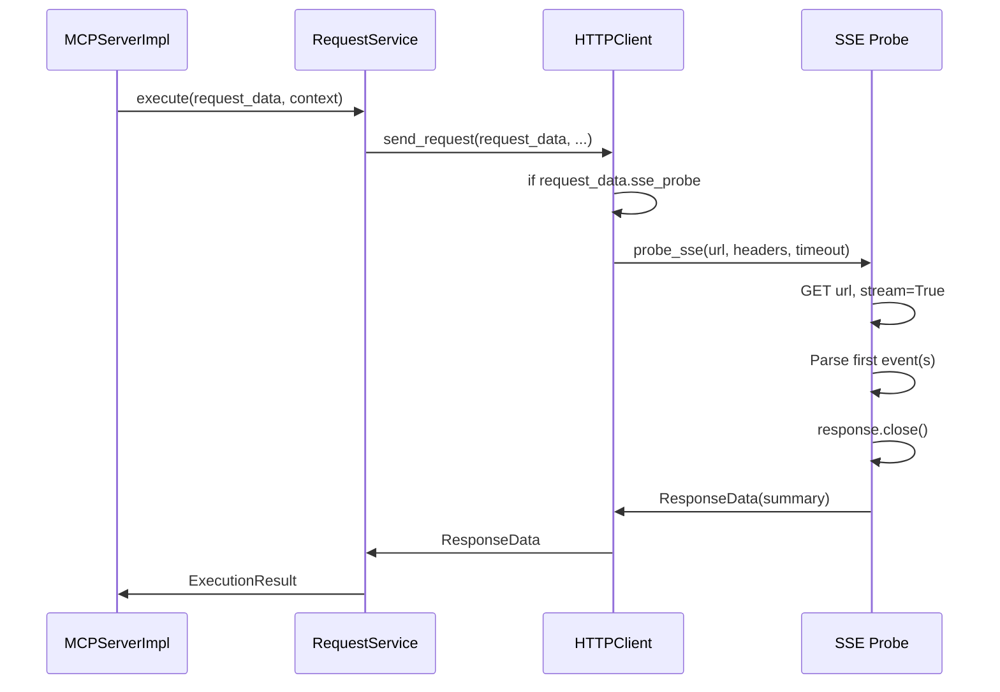

# PYPOST-39: MCP Tools Should Support Testing MCP Servers

## Research

### MCP Transport

- MCP uses **Streamable HTTP** (new) or legacy **HTTP+SSE** transport.
- PyPost uses the legacy SSE transport: GET `/sse` opens a long-lived stream; POST
  `/sse/messages` sends client messages.
- On GET `/sse`, the server returns `Content-Type: text/event-stream` and streams
  JSON-RPC events. The connection stays open until closed by client or server.
- For backward compatibility, clients GET the URL and receive an `endpoint` event as
  the first event, indicating the server is operational.

### Root Cause

- `HTTPClient` uses `requests` with `stream=True` and `iter_content()`.
- For SSE, the stream never "ends" until the connection closes.
- `iter_content()` blocks until the server sends more data or closes the connection.
- Result: indefinite block or "Connection closed" when the client times out/closes.

### Solution Approaches

| Approach | Pros | Cons |
|----------|------|------|
| **A. SSE-probe mode** | User creates tool as usual; explicit mode for SSE | New field in RequestData; UI change |
| **B. Auto-detect by URL** | No UI change | Heuristic may fail; /sse is convention, not standard |
| **C. Dedicated MCP health tool** | No change to user tools | Not a user-created tool; different workflow |
| **D. MCP protocol operations** | Full MCP support | Complex; requires MCP client SDK; fixed tools |

**Chosen: Approach A (SSE-probe mode)** — Keeps user-created tools as the primary path,
clear intent, predictable behavior. User explicitly marks a request as "SSE probe" when
testing MCP/streaming endpoints.

### Python SSE Handling

- `requests` with `stream=True` can read the response incrementally.
- `sseclient-py` or `requests-sse` can parse SSE events from the stream.
- Pattern: connect → read first N events (or until timeout) → close connection → return
  summary.
- `response.close()` may block briefly; use a short read timeout to bound duration.

## Implementation Plan

1. Add `sse_probe` field to `RequestData` (default `False`).
2. Extend `HTTPClient` with SSE-probe logic: when `sse_probe=True`, use stream mode,
   parse SSE events, read first event(s), close, return structured result.
3. Add SSE parsing dependency (`sseclient-py` or `requests-sse`).
4. Update request editor UI: add checkbox "SSE probe (for MCP/streaming endpoints)".
5. Ensure storage/JSON serialization includes `sse_probe`.

## Architecture

### Module Diagram



### Component Responsibilities

| Component | Responsibility |
|-----------|----------------|
| **RequestData** | New field `sse_probe: bool`. When `True`, request targets SSE/streaming endpoint. |
| **HTTPClient** | Branch in `send_request`: if `sse_probe`, delegate to SSE probe logic. |
| **SSE Probe Handler** | Connect with `stream=True`, parse SSE events, read first event(s) (or timeout), close, return `ResponseData` with summary. |
| **RequestEditor** | Checkbox "SSE probe" bound to `request_data.sse_probe`. |

### Flow: SSE Probe Execution



### Interfaces

**RequestData (extended):**

```python
sse_probe: bool = False  # When True, use SSE-probe logic for streaming endpoints
```

**HTTPClient.send_request:**

- When `request_data.sse_probe` is `True`, call internal `_send_sse_probe()` instead of
  normal `session.request()` + `iter_content()`.
- `_send_sse_probe(url, headers, timeout)` returns `ResponseData` with:
  - `status_code`: 200 if connection established and at least one event received
  - `body`: Human-readable summary, e.g. "SSE stream opened. Received N event(s)."
  - `elapsed_time`, `size`, `headers` as usual.

**SSE Probe behavior:**

- Timeout: configurable (e.g. 10 seconds) to avoid long hangs.
- Read at least the first SSE event (or until timeout).
- On success: return summary with event count and optionally first event type.
- On error: return `ResponseData` with error message in body, appropriate status.

### Dependency

- Add `sseclient-py` (or `requests-sse`) to `requirements.txt` for SSE event parsing.

### Out of Scope (this task)

- Full MCP client (Initialize, list_tools, call_tool) as separate tools.
- Auto-detection of SSE by URL pattern.
- Changing MCP protocol or transport.

## Q&A

- **Q:** Why `sse_probe` instead of auto-detect? **A:** Explicit intent avoids false
  positives (e.g. REST APIs under `/sse`) and gives users control.
- **Q:** Why not a dedicated built-in tool? **A:** User-created tools are the primary
  workflow; a new mode keeps the same UX (create request, mark as MCP tool, use it).
- **Q:** What if the server sends no events before timeout? **A:** Return a result
  indicating "Connection opened, no events received within timeout" — still better than
  indefinite hang or opaque "Connection closed".
