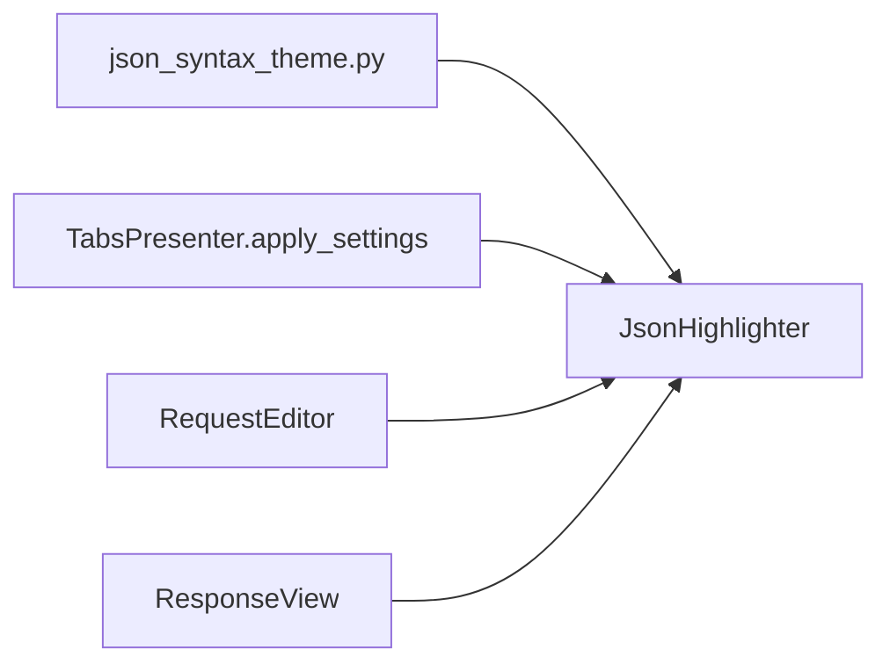

# PYPOST-395: Architecture — dark JSON syntax palette

## Research

- PYPOST-398 introduced `JsonSyntaxColors`, `DEFAULT_JSON_SYNTAX_COLORS`, and injectable
  `colors` on `JsonHighlighter`.
- `StyleManager` applies QSS only; syntax highlighter colors are separate.
- `CodeEditor` gutter uses `QPalette` roles — same pattern for theme detection.
- `AppSettings` has no `theme` field; palette auto-detection is sufficient for this task.

## Implementation plan

1. Extend `json_syntax_theme.py` with `DARK_JSON_SYNTAX_COLORS`, `is_dark_palette()`, and
   `resolve_json_syntax_colors()`.
2. Extract `JsonHighlighter._build_rules()`; add `set_colors()` for runtime updates.
3. Default constructor calls `resolve_json_syntax_colors()` when `colors` is None.
4. `TabsPresenter.apply_settings` calls `set_colors(resolve_json_syntax_colors())` on each
   tab's request/response highlighters.
5. Add tests for dark palette, resolver, and `set_colors`.
6. Update `doc/dev/json_syntax_highlighting.md`.

## Architecture



| Module | Responsibility |
| ------ | -------------- |
| `json_syntax_theme.py` | Light/dark palettes + palette-based resolver |
| `json_highlighter.py` | Rule building, `set_colors`, highlight pass |
| `tabs_presenter.py` | Refresh highlighter colors on `apply_settings` |

### Dark palette (hex)

| Field | Value | Rationale |
| ----- | ----- | --------- |
| `keyword` | `#79c0ff` | Light blue, readable on dark gray |
| `number` | `#56d4dd` | Cyan accent |
| `string` | `#7ee787` | Soft green |
| `key` | `#d2a8ff` | Lavender |
| `placeholder` | `#ffa657` | Warm orange for `{{...}}` |

## Verification

```bash
QT_QPA_PLATFORM=offscreen .venv/bin/python -m pytest tests/test_json_highlighter.py -q
```
