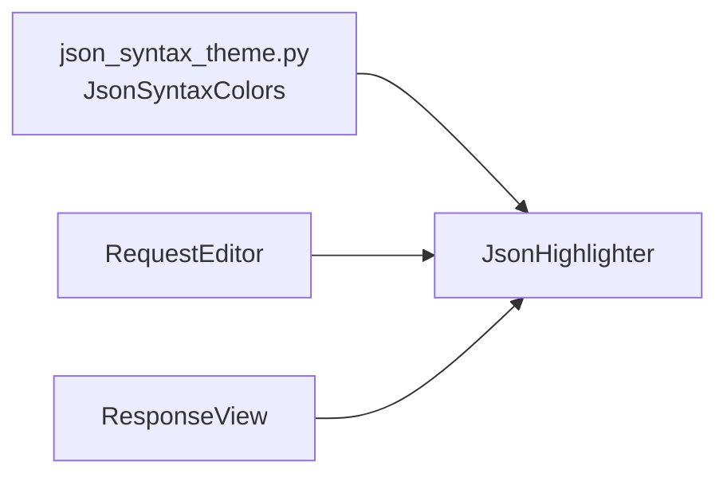

# PYPOST-398: Architecture — JsonHighlighter theme colors

## Research

- Colors were hardcoded in `JsonHighlighter.__init__` (PYPOST-9 debt).
- `AppSettings` has no theme fields yet; dark theme is tracked as PYPOST-395.
- `StyleManager` handles QSS, not `QSyntaxHighlighter` token colors.
- `QSyntaxHighlighter` requires `QTextCharFormat` with `QColor` at highlight time; a small
  immutable colors type is sufficient.

## Implementation plan

1. Add `JsonSyntaxColors` dataclass with string color names and module-level
   `DEFAULT_JSON_SYNTAX_COLORS`.
2. Refactor `JsonHighlighter(document, colors=None)` to build formats from `colors`.
3. Keep `RequestEditor` / `ResponseView` call sites unchanged (defaults).
4. Extend tests with custom-color case; keep existing assertions on default names.
5. Update `doc/dev/json_syntax_highlighting.md`.

## Architecture



| Module | Responsibility |
| ------ | -------------- |
| `pypost/ui/theme/json_syntax_theme.py` | Default and injectable color names per token class |
| `pypost/ui/widgets/json_highlighter.py` | Regex rules + format application from `JsonSyntaxColors` |
| `pypost/ui/widgets/request_editor.py` | Unchanged wiring; uses default theme |
| `pypost/ui/widgets/response_view.py` | Unchanged wiring; uses default theme |

### JsonSyntaxColors fields

| Field | Default | Token |
| ----- | ------- | ----- |
| `keyword` | darkblue | `true`, `false`, `null` |
| `number` | blue | numeric literals |
| `string` | green | quoted strings |
| `key` | purple | object keys |
| `placeholder` | darkorange | `{{...}}` templates |

### Future (PYPOST-395)

Add `DARK_JSON_SYNTAX_COLORS` (or palette resolver) in the same module; inject from
`MainWindow.apply_settings` when theme support lands.

## Verification

```bash
QT_QPA_PLATFORM=offscreen .venv/bin/python -m pytest tests/test_json_highlighter.py -q
```
