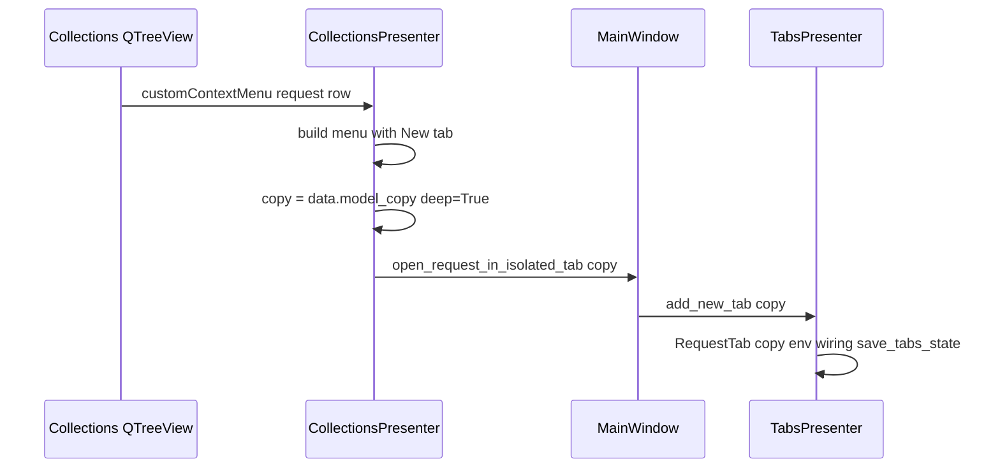

# PYPOST-405: Architecture — Independent tab from Collections context menu

## 1. Overview

The Collections tree stores `RequestData` instances on `QStandardItem` nodes (`Qt.UserRole`).
`MainWindow` connects `CollectionsPresenter.open_request_in_tab` directly to
`TabsPresenter.add_new_tab`, so the **same object** can back more than one tab. Edits mutate
that shared model, which breaks the requirement for isolated buffers.

The design adds a **request-only** context-menu action that opens a tab with a **deep copy**
of `RequestData`. The copy keeps the same `id` so save/update flows and
`rename_request_tabs` continue to key off `request_data.id`. Global env injection in
`add_new_tab` stays unchanged.

A related fix applies to **session restore**: `save_tabs_state` can persist the same `id`
multiple times when several tabs edit one request. `restore_tabs` currently calls
`find_request` repeatedly; the index returns the **same** `RequestData` reference each time,
so restored tabs would share one model. Restoration should pass a **deep copy per tab**
when building widgets.

Out of scope (per requirements): changing left-click behavior on tree items.

---

## 2. Affected components

- **`pypost/ui/presenters/collections_presenter.py`**  
  New `Signal` for “open isolated tab”; extend `_show_context_menu` (menu layout, request-only
  action, telemetry hook).

- **`pypost/ui/main_window.py`**  
  Wire the new signal to `TabsPresenter.add_new_tab` (same slot as the existing open path).

- **`pypost/ui/presenters/tabs_presenter.py`**  
  `restore_tabs`: pass `found_request.model_copy(deep=True)` into `add_new_tab` so each
  restored tab owns its buffer (covers duplicate ids in `open_tabs`).

- **`pypost/core/metrics.py`** (optional)  
  Reuse `track_gui_new_tab_action(source="collections_context")` when the new action runs,
  unless product prefers a dedicated collection counter (mirror delete/rename pattern).

---

## 3. Data flow



Left-click keeps emitting `open_request_in_tab` with the **tree’s** `RequestData` (no change).

---

## 4. `CollectionsPresenter`

### 4.1 New signal

Add alongside `open_request_in_tab`:

- `open_request_in_isolated_tab = Signal(object)` with payload `RequestData` (already a
  deep copy; consumers must not mutate the tree’s item payload).

Naming may vary (`signal` / `open_request_copy_in_tab`) as long as wiring is explicit.

### 4.2 Context menu (`_show_context_menu`)

1. Resolve `item_type` / `item_id` / `data` as today.
2. Build `QMenu`:
   - If `item_type == "request"` and `data` is `RequestData`: add **\"New tab\"** first
     (`QAction.setToolTip` explaining a separate editing copy; edits in other tabs do not
     sync until save).
   - Always add **Rename** and **Delete** for valid targets (current behavior).
3. `exec` menu; handle **New tab** before rename/delete branches:
   - Log at info level (`collection_request_open_new_tab` or similar).
   - Increment metrics via `track_gui_new_tab_action("collections_context")` (or new
     helper).
   - Emit `open_request_in_isolated_tab.emit(data.model_copy(deep=True))`.
4. Do **not** show New tab for collection rows.

Menu order keeps the new action discoverable and avoids accidental delete.

---

## 5. `MainWindow`

In `_wire_signals`:

```python
self.collections.open_request_in_isolated_tab.connect(self.tabs.add_new_tab)
```

No other presenters need this signal unless tests inject mocks.

---

## 6. `TabsPresenter.restore_tabs`

Replace the payload passed to `add_new_tab`:

- Today: `self.add_new_tab(found_request, save_state=False)`
- Target: `self.add_new_tab(found_request.model_copy(deep=True), save_state=False)`

Rationale: each restored `RequestTab` gets its own `RequestData` graph (`dict` fields copied).
`save_tabs_state` / save flows still use `id`; `rename_request_tabs` updates every tab with
matching `request_data.id` by mutating `name` on each tab’s copy (acceptable).

---

## 7. `RequestData` copy semantics

- **`model_copy(deep=True)`** (Pydantic v2) copies nested `headers`, `params`, and
  `retry_policy` so widgets do not share mutable sub-objects.
- **Same `id`**: required so `save_request`, tab state, and rename-by-id behave as today.
- **Collection tree**: still holds canonical instances from `RequestManager`; reloading
  after save (`request_saved` → `load_collections`) refreshes labels without merging unsaved
  tab buffers into the tree model.

---

## 8. Verification

Manual:

1. Open request A in tab 1 via tree click; open the same request via **New tab**; edit URL
   in tab 1 — tab 2 must not show the change until save/reload logic applies.
2. Context menu on a collection folder — no **New tab** entry.
3. Rename request in tree — both tabs for that `id` update titles (`rename_request_tabs`).
4. Close app with two tabs on the same id; reopen — both tabs load; editing one does not
   mutate the other immediately.

Automated (optional): unit test that `_show_context_menu` emits a model distinct from the
item’s `UserRole` object (identity or field mutation) for the new action; requires Qt event
fixture or extracted helper.

---

## 9. Risks and limits

- **Stale buffer after save in another tab** remains acceptable per requirements.
- Deep copy per restore tab slightly increases memory; negligible for typical request size.
- Left-click still shares one `RequestData` if the user opens the same row twice without
  using **New tab**; document as known gap unless a follow-up unifies behavior.
