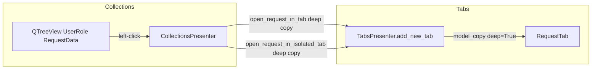
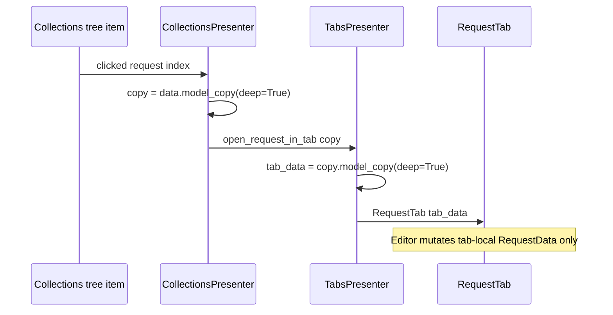

# PYPOST-406: Unify left-click tree navigation object-copying

## Research

- **PYPOST-405** added `open_request_in_isolated_tab` with `data.model_copy(deep=True)` in
  `_show_context_menu` and fixed `restore_tabs` to deep-copy per tab. Left-click in
  `_on_collection_clicked` still emits the tree item’s `RequestData` reference via
  `open_request_in_tab`.
- **MainWindow** wires both signals to the same slot:
  `self.collections.open_request_in_tab.connect(self.tabs.add_new_tab)`.
- **`TabsPresenter.add_new_tab`** passes `request_data` directly into `RequestTab` /
  `RequestWidget` without copying. `persisted_baseline` is snapshotted from whatever instance
  is passed (PYPOST-408).
- **Pydantic v2** `RequestData.model_copy(deep=True)` is the established copy primitive; it
  copies nested `headers`, `params`, and `retry_policy`.
- **Doc reference:** `doc/dev/open_request_in_isolated_tab.md` lists left-click as a known
  limitation pending PYPOST-406.

## Implementation Plan

1. **Centralize isolation in `TabsPresenter.add_new_tab`:** when `request_data` is not
   `None`, replace it with `request_data.model_copy(deep=True)` before constructing
   `RequestTab`. This guarantees every tab owns its buffer regardless of which signal or
   caller supplied the model (left-click, context menu, restore, etc.).
2. **Align `CollectionsPresenter._on_collection_clicked`:** emit a deep copy on
   `open_request_in_tab` so the presenter matches the context-menu contract and tests can
   assert at the tree layer. Redundant with step 1 but keeps emit-site semantics explicit.
3. **Update signal docstrings** on `open_request_in_tab` / `open_request_in_isolated_tab` to
   note that `add_new_tab` always copies non-`None` payloads.
4. **Tests:**
   - Collections: left-click payload is not the same object as the tree `UserRole` data.
   - Tabs: two `add_new_tab` calls with the same source `RequestData` do not share nested
     mutations (e.g. URL edit in tab A invisible in tab B).
5. **Dev docs** (Step 7, not this step): remove left-click limitation from
   `open_request_in_isolated_tab.md`.

## Architecture

### Problem summary

Left-click opens tabs through a shared `RequestData` reference from the tree model. Mutations
in one tab’s editor update the shared object, so other tabs and the tree item alias unsaved
state. Context menu **New tab** and session restore already deep-copy; left-click does not.

### Module diagram

### Sequence: left-click after change

### Component changes

| Module | Change |
|--------|--------|
| `collections_presenter.py` | `_on_collection_clicked` emits deep copy; update signal comment. |
| `tabs_presenter.py` | `add_new_tab` deep-copies non-`None` `request_data` before widget creation. |
| `main_window.py` | No wiring change (both signals still → `add_new_tab`). |
| `tests/test_collections_presenter.py` | Assert left-click payload identity ≠ tree object. |
| `tests/test_tabs_presenter.py` | Assert dual tabs from one source object are isolated. |

### Interfaces

No new public signals. Existing contracts:

- `open_request_in_tab(object)` — `RequestData` intended for a new tab (presenter emits copy).
- `add_new_tab(request_data: RequestData | None, save_state: bool = True)` — always assigns
  an owned deep copy when `request_data` is provided.

### Patterns and justification

- **Defense in depth:** copy at both presenter emit and tab creation so future callers cannot
  accidentally reintroduce shared references.
- **Same `id` on copy:** preserves save, rename-by-id, stale sync (PYPOST-408), and tab state
  persistence semantics from PYPOST-405.

### Risks

- **Double copy** on context-menu path (presenter + `add_new_tab`): negligible for typical
  request size; acceptable for consistency.
- **Tab focus/reuse** unchanged: users may still get multiple tabs for the same id via repeated
  left-clicks; isolation is the scope of this task.

## Q&A

| Question | Answer |
|----------|--------|
| Why copy in `add_new_tab` if presenter already copies? | Single enforcement point for all tab-open paths; left-click fix survives even if a caller passes a shared ref. |
| Should `open_request_in_isolated_tab` be merged with `open_request_in_tab`? | Not in this task; both can remain wired to `add_new_tab`. |
| Does this affect history load? | `load_request_from_history` also benefits from `add_new_tab` copy; acceptable side effect. |
